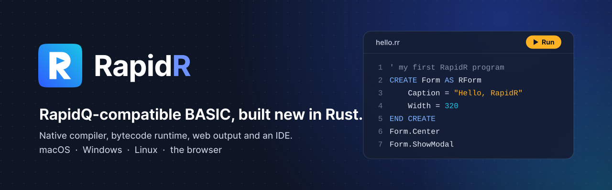

<p align="center"></p>

# RapidR

[](https://github.com/iBobX/RapidR/releases)
[](LICENSE)
[](https://www.rust-lang.org/)
[](https://www.buymeacoffee.com/roanbema)

**RapidR runs and builds RapidQ BASIC programs — and takes them further.**
Your RapidQ program, unchanged, runs as a native executable, in the RapidR
interpreter, or in a web browser, on Windows, macOS and Linux, and behaves
as it does under RapidQ. New programs get what RapidQ never had: high-DPI
screens, screen-reader accessibility, themes, SQLite, data frames and
charts, the web. RapidR is an original implementation written from the
ground up in pure Rust — compatible with RapidQ, not a copy of it.

- **RapidQ-compatible, measured against RapidQ itself.** RapidQ's own
  compiler (RC.EXE) still runs in a virtual machine and is the ground truth:
  numbers, PRINT, colours and edge cases print exactly what RapidQ prints.
- **Three runtimes, one behaviour.** Native code (via generated Rust), a
  bytecode interpreter (the RapidR Runtime, and standalone executables) and
  the browser (WebAssembly). The same conformance suite runs on all three.
- **Every RapidQ object but OLE**: forms and every visual component, the
  dialogs, menus, grids, list and tree views, MDI, the tray icon,
  QREGISTRY, the printer, sockets, MySQL, CGI, serial ports, downloads,
  QMIDI / QWAVE / QVIDEO, and DirectX 2D and Direct3D.
- **RapidR's own UI kernel** draws every window, the same on every system:
  RapidQ's classic look by default, modern / dark / high-contrast themes,
  sharp on high-DPI screens, accessible to screen readers and the keyboard.
- **The web on the same kernel**: a program's windows drawn on a canvas
  (their pixels and accessibility trees checked against the desktop's),
  from a static `.zip` you can host anywhere.
- **Extensions**: SQLite with parameter binding, RJSON, RHTTP, data
  science (`RNum`, `RDataFrame`, `RPlot`), responsive layouts (`Anchors`),
  web-only components.
- **Your programs are yours**: MIT-licensed, and every build ships the
  `THIRD-PARTY-NOTICES.txt` its components ask for. Nothing copyleft and no
  encryption code is compiled into your program.

## Install

Download from **[the latest release](https://github.com/iBobX/RapidR/releases/latest)**.
Each system has two packages:

- **RapidR (the SDK)** — the IDE, the `rapidr` compiler and runtime, and
  everything needed to build. Install this to write programs.
- **RapidR Runtime** — only runs programs (`.rrbc`, `.rr`, `.bas`), like a
  Java runtime, for people you give programs to.

| System | SDK | Runtime only |
|---|---|---|
| **Windows** 10 / 11, x64 or ARM64 | `RapidR-2.117.0-windows-x64-setup.exe` / `…-arm64-setup.exe` | `RapidR-Runtime-2.117.0-windows-<arch>-setup.exe` |
| **macOS** 11 or newer, Apple silicon and Intel (one universal app) | `RapidR-2.117.0-macos-universal.dmg` | `RapidR-Runtime-2.117.0-macos-universal.dmg` |
| **Linux** x86_64 or aarch64: Ubuntu 22.04, Debian 12 or newer | `rapidr_2.117.0_<amd64\|arm64>.deb` or `rapidr-2.117.0-linux-<arch>.tar.gz` | `rapidr-runtime_…` |
| **Web** | `rapidr-web-2.117.0.zip`: the web IDE, for any static host | |

- **Windows**: run the installer (per user, no administrator rights). It
  adds *RapidR IDE* to the Start menu and, if you keep the box ticked,
  `rapidr` to your PATH.
- **macOS**: drag *RapidR* (and/or *RapidR Runtime*) to Applications. Then
  `/Applications/RapidR.app/Contents/MacOS/rapidr setup` offers to put
  `rapidr` on your PATH.
- **Linux**: `sudo apt install ./rapidr_2.117.0_amd64.deb`, or unpack the
  `.tar.gz` and run `./install.sh` (into `~/.local`, no root). Linux needs
  OpenSSL 3 (HTTPS uses the system's), hence Ubuntu 22.04 / Debian 12 and
  newer.

**The downloads aren't code-signed yet.** macOS: the first time,
right-click the app and choose **Open** (or System Settings > Privacy &
Security > **Open Anyway**). Windows: if SmartScreen says "Windows
protected your PC", choose **More info > Run anyway**. Check downloads
against `SHA256SUMS` (`shasum -a 256 -c SHA256SUMS`).

**Rust is needed only for native builds.** Running programs, the IDE,
standalone interpreted executables and web bundles need nothing else. For
native builds, `rapidr setup` installs the exact Rust RapidR was tested
with — beside your own toolchain if you have one (never changing your
default), or rustup itself after asking if you have none. On Windows the
SDK ships its own linker (LLVM-MinGW): no Visual Studio needed.

After installing, `.rrbc` files run on a double click and `.rr` / `.bas`
files open in the IDE (with a *Run* action); a program downloaded from the
internet asks once before it runs.

## Quick start

`hello.bas`:

```basic
PRINT "Hello, World!"
DIM name AS STRING
name = "RapidR"
PRINT "Hi from "; name
```

```sh
rapidr run hello.bas                   # run it (the RapidR Runtime)
rapidr build hello.bas --interp        # a standalone executable, no Rust needed
rapidr build hello.bas --release       # a native executable (Rust: rapidr setup)
rapidr bundle-bc hello.bas -o hello-web.zip   # a web bundle for any static host
```

A window — a plain RapidQ program, which RapidQ's compiler builds too:

```basic
$INCLUDE "RAPIDQ.INC"
DECLARE SUB ButtonClick (Sender AS QBUTTON)

CREATE Form AS QFORM
    Caption = "Hello"
    Width = 320 : Height = 160
    Center
    CREATE Label1 AS QLABEL
        Caption = "Not clicked yet"
        Left = 20 : Top = 20
    END CREATE
    CREATE Button1 AS QBUTTON
        Caption = "Click me"
        Left = 20 : Top = 60
        OnClick = ButtonClick
    END CREATE
END CREATE

SUB ButtonClick (Sender AS QBUTTON)
    Label1.Caption = "Clicked!"
END SUB

Form.ShowModal
```

`rapidr run form.bas` opens it; `rapidr bundle-bc form.bas -o form.zip`,
unzipped and served (`python3 -m http.server -d form 8080`), shows the same
window in a browser. Every build writes `THIRD-PARTY-NOTICES.txt` beside
the executable (or into the bundle): ship it with your program.

Next: **[the user manual](docs/manual/README.md)** and
**[the examples](examples/README.md)**.

## What's in it

| | |
|---|---|
| **The language** | RapidQ's BASIC: SUBs, FUNCTIONs, TYPEs with methods, constructors, events and inheritance, `CREATE` blocks, `WITH`, `GOSUB`, `DATA`, `$INCLUDE` / `$DEFINE` / `$MACRO` / `$RESOURCE`, function pointers, memory functions (memory-safe), console statements — plus VB's `#If`, `i++`, `+=` |
| **Components** | Every RapidQ component and object except OLE, under both names: RapidQ's `QFORM` and RapidR's `RFORM` are one component, and a program can mix them ([reference](docs/manual/reference/components.md)) |
| **UI** | RapidR's own UI kernel on winit, vello, parley and AccessKit: the same look everywhere, Windows' classic look or `$THEME Modern` / `Dark` / `HighContrast`, high-DPI, keyboard and screen readers (VoiceOver, Narrator, NVDA; ARIA on the web), `Anchors` and size constraints |
| **DirectX & media** | QDXSCREEN, QDXIMAGELIST, QDXTIMER, QDXSOUND, QDXJOYSTICK (gamepads), Direct3D retained mode (`.X` models, lights, textures, shadows) on RapidR's software rasterizer; QMIDI with a built-in synthesizer, QWAVE, QVIDEO (AVI), MP3 / Ogg / FLAC / WAV |
| **The web** | the UI kernel on a canvas; SQLite in WebAssembly; web-only components (`RWebView`, `RDOM`, `RJavaScript`, `RWebStorage`, …); a web IDE that compiles in the browser |
| **Databases** | `RSQLite` (SQLite itself, everywhere) and RapidQ's `QMySQL`, with `?` parameter binding |
| **Data science** | `RNum` (arrays), `RDataFrame` (tables), `RPlot` (charts as PNG or in a `QImage`), `RJson` — one implementation on every runtime |
| **The RapidR Runtime** | runs `.rrbc` programs and sources directly; file associations per user; bytecode that says which runtime it needs; `#!/usr/bin/env rapidr` scripts |
| **Builds** | native (Rust; universal on macOS), standalone interpreted executables with no Rust needed (on Windows for x64 and ARM64 alike, on macOS universal), web bundles, `--web` native WebAssembly |

## Platforms checked

Each release is checked on macOS (Apple silicon), Windows 11 (ARM64) and
Ubuntu 24.04 (ARM64, Wayland and X11): the conformance suite on every
backend, the GUI test programs headless and with real windows, the unit
tests, and what a screen reader sees (macOS Accessibility, Windows UI
Automation). The browser suites run in Chromium. The installers are
smoke-tested on each system — the x64 Windows and x86_64 Linux packages
under emulation on ARM machines. The Intel slice of the macOS apps is
checked by inspection only (no Intel Mac in the loop yet).

## Documentation

- **[User manual](docs/manual/README.md)**: getting started, the language,
  components, the CLI and Runtime, the web, databases, data science,
  DirectX and media, differences from RapidQ, troubleshooting.
- **[Examples](examples/README.md)**.
- **[CHANGELOG.md](CHANGELOG.md)**: every version's changes;
  **[ROADMAP.md](ROADMAP.md)**: what comes next (the full IDE with
  IntelliSense, a debugger and AI assistance; an AI component; mobile).
- **[COMPILER_MANUAL.md](COMPILER_MANUAL.md)**: for contributors — the
  architecture, building and testing.
- **[LEGAL.md](LEGAL.md)**: what you may do with RapidR and your programs.

## Building from source

```sh
git clone https://github.com/iBobX/RapidR.git
cd RapidR
cargo build --release -p rapidr-cli && cp target/release/rapidr .
./rapidr run examples/hello_world.rr
```

You need Rust (via [rustup](https://rustup.rs/)) and a C compiler (some
bundled C libraries: SQLite, zstd, …):

- **macOS**: `xcode-select --install`
- **Linux (Debian/Ubuntu)**: `sudo apt install build-essential pkg-config
  libfontconfig1-dev libasound2-dev libssl-dev` (windows also need
  xkbcommon and X11 or Wayland, which a desktop has)
- **Windows**: Visual Studio Build Tools (MSVC), or LLVM-MinGW with Rust's
  `*-pc-windows-gnullvm` toolchain as the releases use

A checkout works like an install: `./rapidr` finds the runtime sources
next to it, builds its own runners for `--interp`, and builds the web
interpreter with `tools/build_web_artifacts.sh` (needs `wasm-pack`). The
contributor manual covers the tests (`tools/regress.sh`) and the release
tooling.

## Support RapidR

RapidR is free and open source (MIT), built by one developer. If it's
useful to you — or you'd like to see the IDE and the next releases sooner —
you can support its development:

<p><a href="https://www.buymeacoffee.com/roanbema"></a></p>

Every coffee helps pay for the tools and compute that build RapidR. Thank
you! Testing helps just as much: try your RapidQ programs and
[report what differs](https://github.com/iBobX/RapidR/issues/new/choose).

## Credits

- **Roberto Berrospe** ([@iBobX](https://github.com/iBobX)) — Creator, architect, and lead developer
- **VS Code Copilot/Claude + Antigravity/Gemini** — AI pair-programming assistant for feature implementation, testing, and documentation

RapidQ was created by William Yu. RapidR is compatible with RapidQ and is
not affiliated with its author or with any vendor it names.

RapidR stands on the shoulders of open-source software: winit, wgpu, vello,
parley and AccessKit (the UI), wasm-bindgen, the Monaco editor (the web
IDE), plotters, SQLite and hundreds of Rust crates. The
full list, with licenses and links, is in
[THIRD_PARTY_NOTICES.md](THIRD_PARTY_NOTICES.md) (generated from the
dependency graph) and [LICENSES.md](LICENSES.md) (vendored JavaScript and
license texts). New dependencies must be open source under a permissive
license accepted by `deny.toml`.

## Licensing

**The programs you build with RapidR are yours**: sell them, give them away,
keep their source closed. Ship each one with the `THIRD-PARTY-NOTICES.txt`
RapidR writes beside it (native and interpreted executables) or into it (web
builds): it carries the notices and licence texts of RapidR's runtime and of
the open-source components inside, generated from the build's real
dependency graph (`rapidr notices` prints it). That is all their licences ask;
none restricts commercial or closed-source use, and nothing GPL, LGPL, MPL
or AGPL is compiled into a program.

- [LEGAL.md](LEGAL.md): what you may do with RapidR and your programs, what
  to ship, trademarks (RapidR is compatible with RapidQ and not affiliated
  with its author or any vendor it names), no warranty.
- [docs/licensing.md](docs/licensing.md): what each kind of output contains,
  licence by licence, and what each licence asks; codecs and patents; the
  checks (`tools/regress.sh legal`).

RapidR itself is licensed under the [MIT License](LICENSE).
