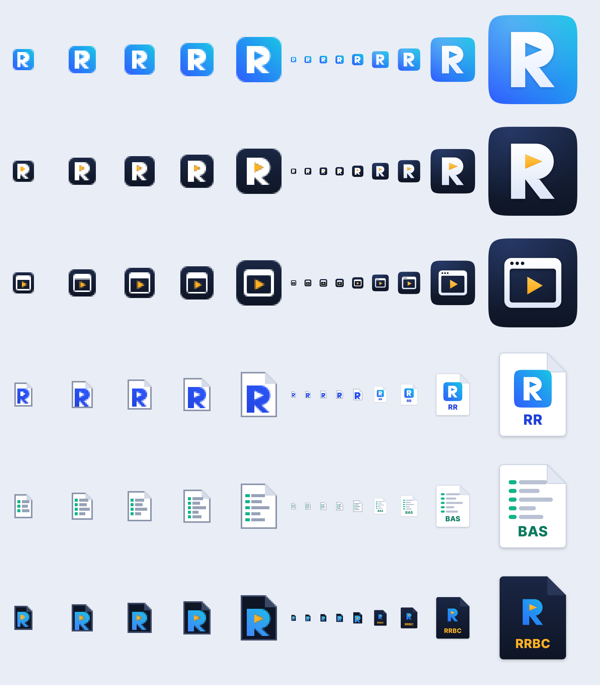

# RapidR brand

The RapidR logo, app and file-type icons, and GitHub art. The **SVG masters in this folder are the source of truth**; every PNG, `.icns` and `.ico` is built from them by `src/export.py`.



## The mark: "Run"

A constructed geometric **R** on a rounded tile. The R's counter (the hole in the bowl) is a **play triangle**: RapidR runs what you write. The mark keeps one clear idea, so it stays legible at 16 px, and the tile doubles as the app icon.

Three concepts were drawn first. They are compared in [`concepts.png`](concepts.png), with sources in [`concepts/`](concepts):

| Concept | Idea | Verdict |
|---|---|---|
| A, Velocity | A forward-leaning R trailing three speed bars | Says "rapid", but speed bars are a common trope, and they turn to noise at 16 px |
| B, Prompt | The R as a command prompt: a chevron bowl and a block cursor | Strong BASIC heritage, but it can read as "P_" or a flag, and it is weak at small sizes |
| **C, Run** | A constructed R with a play-triangle counter, on a tile | **Chosen.** It is the clearest at 16 px, works as a tile out of the box, and the counter tells you what the product does |

The Runtime gets the same tile in Ink, with the play-triangle counter lit up in Run Amber: the same R, now running.

Programs built with RapidR (`rapidr build`) get the **program icon** until they have their own: the Runtime's Ink tile with an app window drawn in white and the Run triangle in amber inside it — made with RapidR, running. It is what Finder, Explorer and the Linux menus show for a compiled app ([docs/manual/building-apps.md](../../docs/manual/building-apps.md)).

## Palette

| Name | Hex | Use |
|---|---|---|
| Ink | `#0E1525` | Text, monochrome mark, dark tiles and backgrounds |
| Paper | `#F6F8FC` | Light backgrounds |
| RapidR Blue | `#2F5BFF` | Primary; start of the brand gradient |
| Blue Deep | `#1E3FD8` | Blue text on light, `.rr` labels |
| Blue on Dark | `#6E93FF` | Blue text on Ink (the lockup's final R on dark) |
| Spark Cyan | `#19C6E6` | End of the brand gradient; accents on dark |
| Run Amber | `#FFB224` | The Runtime and compiled programs (`.rrbc`, the program icon); "Run" |
| BASIC Teal | `#12B48A` | The generic `.bas` source icon (graphics only) |
| BASIC Teal Deep | `#0B7B5E` | Teal text on light |
| Slate | `#5B6478` | Secondary text on light |
| Mist | `#C9D1E3` | Secondary text and hairlines on dark |

**Brand gradient:** RapidR Blue to Spark Cyan, running from the bottom-left to the top-right.

### Contrast (WCAG 2.x)

Normal text needs 4.5:1 for AA; large text (24 px, or 18.7 px bold) and graphics need 3:1.

| Foreground on background | Ratio | Text use |
|---|---|---|
| Ink on Paper | 17.1:1 | AA, AAA |
| Ink on white | 18.2:1 | AA, AAA |
| White on RapidR Blue | 5.2:1 | AA |
| RapidR Blue on white | 5.2:1 | AA |
| RapidR Blue on Paper | 4.9:1 | AA |
| Blue Deep on white | 7.6:1 | AA, AAA |
| Blue on Dark on Ink | 6.3:1 | AA |
| Mist on Ink | 11.9:1 | AA, AAA |
| Slate on Paper | 5.6:1 | AA |
| Run Amber on Ink (and Ink on Run Amber) | 10.1:1 | AA, AAA |
| Spark Cyan on Ink | 8.9:1 | AA, AAA |
| BASIC Teal Deep on white | 5.2:1 | AA |
| RapidR Blue on Ink | 3.5:1 | Large text and graphics only; use Blue on Dark for text |
| BASIC Teal on white | 2.7:1 | Graphics only, never text |
| White on Spark Cyan | 2.1:1 | Never: put Ink on cyan instead (8.9:1) |

## Using the logo

- **Clear space:** keep a margin of at least **¼ of the tile's height** clear on every side of the mark and the lockup. Nothing else should go in it: no text, edges or busy imagery.
- **Minimum size:**
  - the mark is 16 px on screen (below 48 px use the hinted icon files, not a scaled master) and 6 mm in print;
  - the lockup is 24 px tall on screen and 8 mm in print;
  - below that, use the mark alone.
- **Light backgrounds:** use `rapidr-lockup.svg` (Ink wordmark, blue final R). **Dark backgrounds:** use `rapidr-lockup-dark.svg`. **One colour** (print, embossing, overlays): use the `-mono-ink` and `-mono-white` files, where the R is knocked out of the tile.
- **Don't:**
  - recolour, stretch, rotate or outline the mark;
  - add shadows or effects beyond those in the icon masters;
  - re-type the wordmark in a live font (it is drawn as outlines, so use the files);
  - turn the play triangle into another shape;
  - put the colour mark on a busy photo.
- **Use the name in text** as `RapidR`, with a capital R at both ends and no space.

## Files

### Logo: `logo/`

| File | What it is for |
|---|---|
| `rapidr-mark.svg` | The mark: gradient tile with a white R. Avatars, favicons, anywhere square |
| `rapidr-mark-mono-ink.svg`, `rapidr-mark-mono-white.svg` | One-colour mark (R knocked out) for light and dark grounds |
| `rapidr-glyph.svg` | The bare R in the gradient, for places that already supply a tile or a coloured ground |
| `rapidr-lockup.svg` | Horizontal lockup (mark and "RapidR") for light backgrounds |
| `rapidr-lockup-dark.svg` | The same for dark backgrounds |
| `rapidr-lockup-mono-ink.svg`, `rapidr-lockup-mono-white.svg` | One-colour lockups |
| `png/` | Ready-made PNGs of the mark (512 px) and the lockups (160 px tall) |

### Icons: `icons/`

| Path | Contents |
|---|---|
| `svg/app-ide-macos.svg`, `svg/app-runtime-macos.svg`, `svg/app-program-macos.svg` | macOS masters (1024 grid, Apple's 824 px rounded-square tile with continuous corners, and the drop shadow) |
| `svg/app-ide-full.svg`, `svg/app-runtime-full.svg`, `svg/app-program-full.svg` | Windows and Linux masters (tile fills 92 % of the canvas) |
| `svg/app-*-16/20/22/24/32.svg`, `svg/app-*-mac32.svg` | Hand-hinted small sizes, drawn on the pixel grid (`mac32` keeps the Apple margin at 32 px) |
| `svg/file-rr.svg`, `svg/file-bas.svg`, `svg/file-rrbc.svg` (and `-16`…`-32`) | File types: `.rr` RapidR source, `.bas` generic BASIC source, `.rrbc` compiled program. Masters and hinted small sizes |
| `svg/web-touch-icon.svg` | Full-bleed, opaque master for `apple-touch-icon` |
| `macos/*.icns` | `RapidR.icns` (IDE), `RapidR-Runtime.icns`, `RapidR-Source.icns` (.rr), `BASIC-Source.icns` (.bas), `RapidR-Program.icns` (.rrbc), `RapidR-App.icns` (the program icon: compiled apps). Each has 16 to 512 px at @1x and @2x |
| `windows/*.ico` | `rapidr-ide.ico`, `rapidr-runtime.ico`, `rapidr-source.ico`, `basic-source.ico`, `rapidr-program.ico`, `rapidr-app.ico` (the program icon). Each has 16, 20, 24, 32, 40, 48, 64 and 256 px, as PNG-compressed entries (Windows Vista and later) |
| `linux/hicolor/` | A freedesktop icon-theme tree (16, 22, 24, 32, 48, 64, 128, 256, 512 and `scalable`). App icons are `apps/rapidr-ide`, `apps/rapidr-runtime` and `apps/rapidr-app` (the program icon). MIME icons are `mimetypes/text-x-rapidr`, `text-x-rapidq-basic` and `application-x-rapidr-bytecode`, matching `tools/release/linux/rapidr.xml` |
| `web/` | `favicon.svg`, `favicon-32.png`, `apple-touch-icon.png` (180 px) and `icon-512.png`. The web IDE serves copies from `web-ide/icons/` |
| `preview.png` | Every icon at every size; hinted sizes are also shown magnified (rows: IDE, Runtime, program, .rr, .bas, .rrbc) |

### GitHub: `github/`

| File | Use |
|---|---|
| `banner.svg`, `banner.png` | README banner, 1280 × 400 (used at the top of the repository README) |
| `social-preview.svg`, `social-preview.png` | Repository social preview, 1280 × 640 |

**Set the social preview** (only a repository admin can, and only on github.com):
1. On github.com/iBobX/RapidR, open **Settings**, then **General**.
2. Under **Social preview**, choose **Edit**, then **Upload an image…**.
3. Pick `design/brand/github/social-preview.png`.

GitHub uses this image when the repository link is shared (on Slack, X, Discord and elsewhere). It needs to be under 1 MB; this one is about 140 KB.

### Concepts and sources

- `concepts.png`, `concepts/`: the three original concepts, kept for the record.
- `src/`: the Python that wrote the masters and builds the exports.
  - `marks.py`: the mark geometry.
  - `icons.py` also draws the program icon (`app_icon("program", …)`, `SMALL_WIN` for the hinted sizes); `rapidr build` embeds its SVG masters (crates/rapidr-package).
  - `icons.py`, `logo.py`, `github.py`, `concepts.py`: the masters.
  - `export.py`: the PNG, `.icns` and `.ico` builds.
  - `brandkit.py`: path maths, the squircle, and text-to-outline.

## Rebuilding

```sh
python3 design/brand/src/make.py export   # PNG/ICNS/ICO/hicolor/web from the committed SVGs
python3 design/brand/src/make.py          # also rewrite the SVG masters first
```

- **Exports** need only `rsvg-convert` (librsvg), macOS's built-in `iconutil`, and Pillow. The `.ico` writer is our own code. These are build tools, so nothing they produce carries their licence.
- **Rewriting the masters** also needs fontTools (MIT) and Inter at `src/fonts/Inter-V.ttf`. This is the variable font, v3.x, from github.com/rsms/inter; you can point `RAPIDR_BRAND_FONT` at it instead. The font file is git-ignored: the committed SVGs are already outlined.

## Licence and ownership

- **Original artwork.** Every mark, icon and graphic here was drawn for the RapidR project as original vector geometry. None of it uses stock imagery, AI image generators, or traced or adapted logos. It is distributed under the project's licence, **MIT** (see [`LICENSE`](../../LICENSE)).
- **Fonts, outlined.** No SVG here needs a font: all lettering is converted to outlines.
  - The "RapidR" wordmark and the labels (file-icon extensions, the text in the banner and social preview) are outlined from **Inter**, © The Inter Project Authors, under the **SIL Open Font License 1.1**.
  - The code in the banner and social preview is outlined from **Liberation Mono**, under the **SIL Open Font License 1.1**. It ships with RapidR in `crates/rapidr-value/fonts/`.
  - The OFL allows using the fonts in artwork; the outlines are credited here.
- **Trademark.** The MIT licence covers copyright, not the name or the logo. Consider registering **"RapidR"** and the Run mark as trademarks (for example with the USPTO or EUIPO, in class 9 for software) before the first public release, and add a short trademark policy that says how others may refer to the project. "RapidQ" is the name of a different product; use it only to describe compatibility (for example, "RapidQ-compatible").
