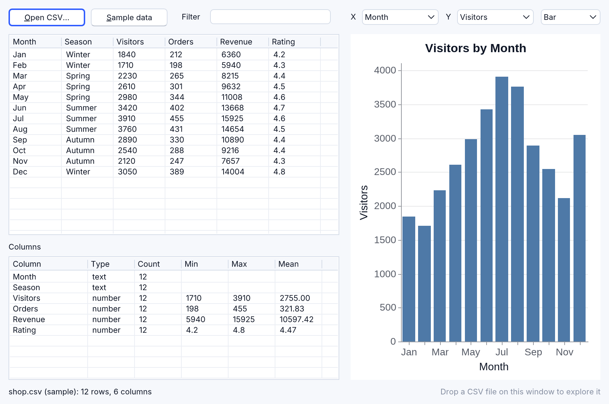
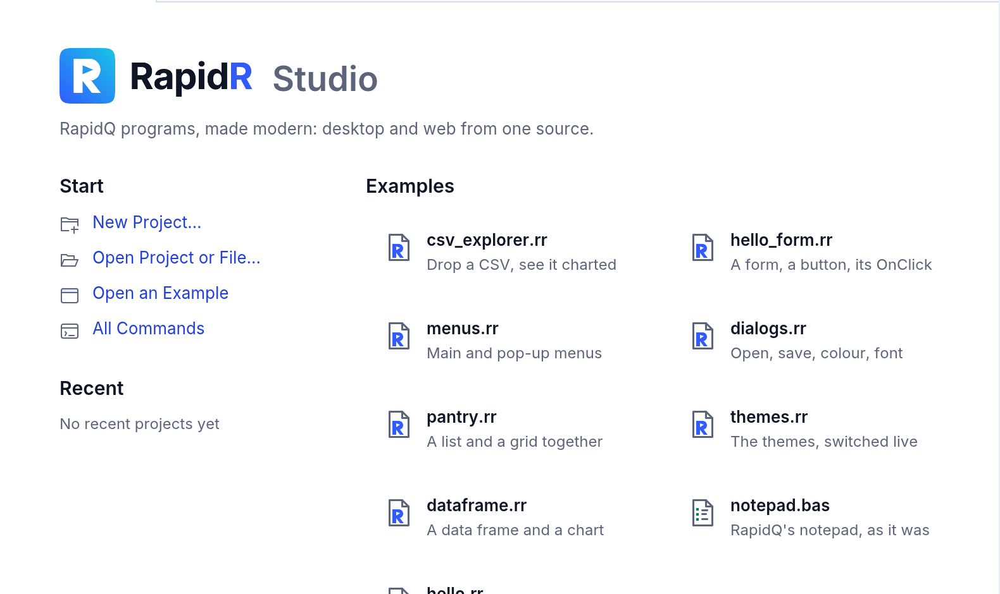
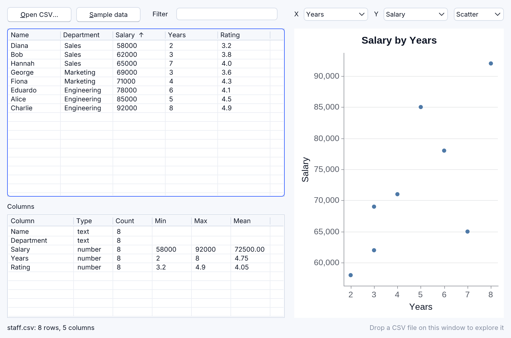
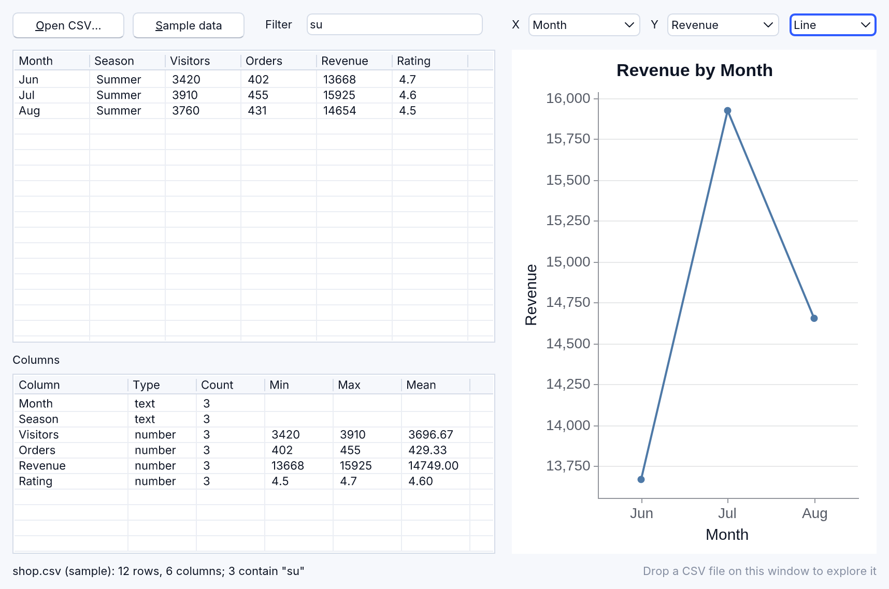
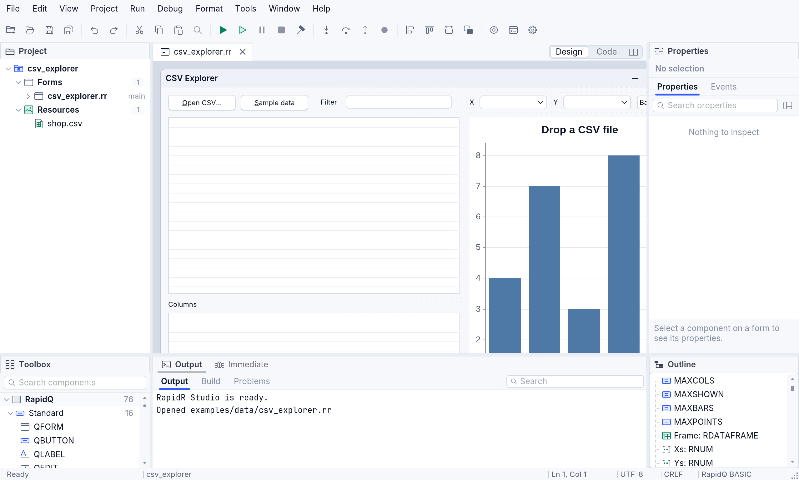

# Data science

RapidR's own components for numbers, tables, charts and JSON — not in
RapidQ, and usable from any RapidR program, console or GUI. Every member
name, with its aliases and where it works: [reference/data-science.md](reference/data-science.md).

| Component | |
|---|---|
| `RNum` | a one-dimensional array of numbers, in the manner of NumPy |
| `RDataFrame` | a table, in the manner of pandas |
| `RPlot` | charts shown in an RImage or saved as PNG, in the manner of Matplotlib |
| `RJson` | JSON documents |

RNum, RDataFrame and RPlot are one implementation (RapidR's own, in pure
Rust, with no data library underneath) that native builds, interpreted
programs and the browser all run, so every member gives the same result
everywhere — charts included: they're drawn by the UI kernel, as the
windows are, so a chart is the same pixels on the desktop and in a
browser.

## RNum

```basic
DIM a AS RNum
a.arange 0, 10, 1                ' 0 … 9   (also linspace, zeros, ones, full, fromlist)
PRINT a.sum; " "; a.mean; " "; a.max      ' 45 4.500000000 9
a.multiply 2                     ' element-wise, in place
PRINT a.tolist                   ' 0,2,4,6,8,10,12,14,16,18

DIM b AS RNum
b.fromlist "1,2,3,4,5"
DIM c AS RNum
c.linspace 0, 1, 5
c.square
PRINT c.dot("b")                 ' another array is named by its component's name
```

Methods: creation (`arange`, `linspace`, `zeros`, `ones`, `full`,
`fromlist`), aggregates (`sum`, `mean`, `min`, `max`, `std`, `var`,
`median`, `argmin`, `argmax`, `count`, `ptp`), element-wise math in place
(`sin`, `sqrt`, `log`, `abs`, `round`, …), arithmetic with a number or
another array (`add`, `subtract`, `multiply`, `divide`, `power`, `mod`,
`clip`), ordering (`sort`, `reverse`, `unique`, `shuffle`, `append`,
`slice`), `cumsum` / `cumprod` / `diff`, `dot` / `norm` / `normalize`,
`any` / `all` / `where` / `searchsorted`, random numbers (`rand`, `randn`,
`uniform`, `randint` — both ends included —, `choice`), one element
(`get(i)`, `set i, value` — past the end the array grows —, `push`),
`tolist`, `print`. Properties: `Size` (`Length`, `Count`), `Data` (the
values as `"1,2,3"`, settable), `Shape` (`(3,)`), `NDim`, `DType`, and the
aggregates `Sum`, `Mean`, `Min`, `Max`, `Std`. Numbers print as RapidR
prints them (`0.1 + 0.2` is `0.3`).

## RDataFrame

```basic
DIM df AS RDataFrame
df.loadfromcsv "people.csv"            ' name,age,city
PRINT df.rowcount; "x"; df.colcount; " "; df.columns   ' 4x3 name,age,city
df.filter "age", ">", 30              ' =, <>, >, <, >=, <=, contains, startswith, endswith
df.sort "name", 1                      ' 1 ascending, 0 descending
PRINT df.cell(0, 1)                    ' row 0, column 1 (or its name): the text, "30"
df.print                               ' the frame as a table, below
df.savetocsv "older.csv"
df.togrid "Grid1"                      ' fill an RStringGrid with it (headers and cells)
```

`Print` (and `PRINT df.ToString`) shows the frame as a plain-text table, the
same on every runtime — numbers right-aligned, a missing value as `null`,
the first and last ten rows of a longer frame:

```text
name  age  city
----  ---  ----
bob    30  NYC
amy    25  LA
[2 rows x 3 columns]
```

A cell is its text as read (`cell` and `cellbyname` return it as is); an
empty CSV field, `NA` or JSON's `null` is a missing value. A column's type
(`dtypes`: `i64`, `f64`, `bool`, `str`) is what its cells are, and decides
how it sorts and compares: numbers as numbers, text as text.

Methods change the frame in place: I/O (`loadfromcsv` and `loadfromjson`
take a file — or the data itself, `"a,b" + CHR$(10) + "1,2"` —, `savetocsv`,
`savetojson`: an array of records), selection (`head`, `tail`, `select`,
`cell(row, col)`, `cellbyname(row, name)`, `setcell row, col, value` — past
the end the frame grows —, `iloc`), `sort` / `sort_values` (several columns:
`"city,name"`), `filter`, `query "age > 30"`, `groupby(column, function)`
(the column first, then `mean`, `sum`, `count`, `min`, `max`, `first`,
`last`, `median` or `std` of every other column, a row a group), columns
(`drop`, `rename`, `addcolumn name, "v1,v2,…"`), missing data (`fillna`,
`dropna`), statistics (`describe` — the frame becomes the summary of its
numeric columns —, `value_counts`, `nunique`, `corr`), sampling (`sample`,
`nlargest`, `nsmallest`), joins (`merge other, on, how` — `inner`, `left`,
`right`, `outer`, `cross` —, `concat`), transforms (`transpose`, `apply`
— `upper`, `lower`, `trim`, `abs`, `round`, `sqrt`, `log`, `exp` —,
`replace`), building one (`create`, `addrow`), `info`, `togrid`.
Properties: `RowCount`, `ColCount`, `Columns`, `Shape`, `Empty`, `DTypes`.

A frame is stored by columns (each column's text in one block, its type
and numbers worked out once), so big tables are quick: a million-row CSV
(37 MB) loads in about 0.1 s, and is filtered, sorted, grouped or joined in
40–200 ms on a 2024 laptop — about twice that in a browser
(`cargo run --release -p rapidr-value --example frame_bench`).

## RPlot

A chart's data are RNum components, named by their names:

```basic
DIM x AS RNum
DIM y AS RNum
x.linspace 0, 6.28, 50
y.linspace 0, 6.28, 50
y.sin

DIM plt AS RPlot
plt.title = "Sine"
plt.xlabel = "x"
plt.ylabel = "sin(x)"
plt.grid = 1
plt.plot "x", "y", "sin(x)", "steelblue"   ' x array, y array, label, colour
plt.legend
plt.savefig "sine.png"
```

Series: `plot` (x, y, label, colour, style: `-`, `--` dashed, `:` dotted,
`o` markers, `o-` a line with markers), `bar`, `barh`, `scatter`, `step`,
`area` (x, y, label, colour), `hist(data, bins, label, colour)`,
`pie(data, labels, colours)`; `addseries(label, y, x, colour)` (a line
from numbers written in place), `hline` / `vline`, `annotate(text, x, y,
colour)`, `legend`, `grid`, `xlim` / `ylim`, `xscale` / `yscale` (`"log"`),
`xticks(names [, positions])`, `figsize(w, h)` (inches),
`savefig(file [, scale])`, `show`, `clear`. Properties: `Title`, `XLabel`,
`YLabel`, `Grid`, `Legend`, `Width`, `Height` (pixels; under 100, inches at
the chart's `DPI`), `DPI`, `Count` (the series).

Data are RNum components or numbers written in place (`"35,25,40"`) — and
an x can be **names**: bars over their categories, several bar series side
by side in each.

```basic
plt.bar "Q1,Q2,Q3,Q4", sales2025, "2025"
plt.bar "Q1,Q2,Q3,Q4", sales2026, "2026"
plt.legend
```

Colours are the CSS names (`steelblue`, `royalblue`, `coral`, … all 148),
`#RGB` / `#RRGGBB`, `C0` … `C9` (the palette's), or colour numbers
(`RGB(255, 0, 0)` makes one); series without one take the next of a ten-colour
palette made for charts. The look: ticks at round steps — whole numbers
for whole-number data (months 1, 2, 3, never 1.5) —, light horizontal
gridlines (`Grid = 1`: both ways; `Grid = 0`: none), a legend drawn as the
series are (a dashed line's entry is dashed) where it hides the fewest
points, pies with their percentages and names, and the current theme's
colours (`$THEME dark` draws dark charts, high contrast plain ones). Text
is the UI kernel's: the built-in Liberation Sans, the same on every system.

To show a chart in a window, put the RPlot on the form — `CREATE Chart AS
RPlot … END CREATE`, with `Left`, `Top`, `Width` and `Height` like any
component: it draws itself there and again after every change (a series
added, a property set, `Clear`). `Clear` empties the chart but keeps its
size, as Matplotlib's `clf` keeps the figure's. In RapidR Studio's designer
a chart with no data yet shows sample bars under its `Title`, so you see
where it is and how big; the program's data replaces them when it runs.
Or show it in a picture: `Image1.LoadFromPlot plt` (an RImage). Either way
it's crisp at any screen scale — a 2× screen gets the chart drawn at 2× —
while a picture's `Pixel`s stay the chart's own size. `savefig "chart.png",
2` writes the PNG at twice the chart's size (on the web, among the page's
files: the program can read it back or offer it as a download).

## Tutorial: the CSV Explorer

[`examples/data/csv_explorer.rr`](../../examples/data/csv_explorer.rr) is a
small, complete data tool in about 450 lines of BASIC: drop any CSV file on
its window and see it as a table, each column's statistics and a chart you
change live. It runs the same as a native app, an interpreted one and in a
browser.



### Try it

1. In RapidR Studio, the Welcome page lists it first under **Examples**:
   click **csv_explorer.rr** (or **File > Open Project or File…**, then
   `examples/data/csv_explorer.rr`). From a terminal:
   `rapidr run examples/data/csv_explorer.rr` — or
   `rapidr run examples/data/csv_explorer.rr mydata.csv` to start with your
   own file.

   

2. Press **F5** (**Run > Run**). The window opens with the sample,
   `shop.csv` (a made-up shop's year: visitors, orders, revenue and rating
   by month).
3. **Drop a CSV file** on the window — from Finder, File Explorer or your
   file manager (in a browser, from your computer). Or click **Open CSV…**
   and pick one; **Sample data** brings the sample back.
4. **Sort**: click a column's heading (an arrow shows the order); click it
   again for the other way.
5. **Filter**: type in **Filter**; only the rows with that text in any
   cell stay — in the table, the statistics and the chart.
6. **Chart**: pick the **X** column (any), the **Y** column (a numeric one)
   and **Bar**, **Line** or **Scatter**. The chart follows at once.





### How it works

- **The data**: an `RDataFrame` reads the file — `Frame.LoadFromCsv(path)`.
  `Frame.Columns` names the columns, `Frame.DTypes` says which hold
  numbers (`i64`, `f64`) and which text, `Frame.Cell(row, column)` gives a
  cell, `Frame.Sort(name, 1)` sorts (0: highest first).
- **The drop**: the form's `OnDropFiles = FilesDropped` names a SUB that
  gets the files' paths, one a line, and loads the first `.csv` one
  ([Files dropped on a form](components.md#files-dropped-on-a-form)).
- **The table** is an `RListView` in report view (`ViewStyle = vsReport`):
  `AddColumns` for the headings, `AddItems` and `AddSubItem` for the rows;
  its `OnColumnClick (Column)` sorts.
- **The filter** is an `REdit` whose `OnChange` marks the rows that contain
  the text (`INSTR(LCASE$(cell), text)`), then fills everything again.
- **The statistics**: each numeric column's values go into an `RNum`
  (`Nums.Push VAL(cell)`), which answers `Min`, `Max` and `Mean`.
- **The chart** is an `RPlot` on the form: `Chart.Clear`, then
  `Chart.Bar(names, Ys, label, "")`, `Chart.Plot(Xs, Ys, label, "", "o-")`
  or `Chart.Scatter(Xs, Ys, label, "")` — Xs and Ys are RNums; X can be
  names (`"Jan,Feb,Mar"`) for bars over categories.
- **The sample** is built into the program with `$RESOURCE SHOP_CSV AS
  "shop.csv"` and read without writing a file: an `RMemoryStream`'s
  `ExtractRes SHOP_CSV`, then `ReadStr`, and `LoadFromCsv` takes the CSV
  text itself.
- **The layout** follows the window's size: the form's `OnResize` places
  the table, the statistics and the chart from `Form.ClientWidth` and
  `ClientHeight`.

In the designer the chart shows sample bars (its data comes when the
program runs), and the project tree lists `shop.csv` under **Resources** —
a file the program names belongs to its project, on the desktop and in the
web IDE alike:



## RJson

```basic
DIM j AS RJson
j.Parse "{" + CHR$(34) + "a" + CHR$(34) + ": {" + CHR$(34) + "b" + CHR$(34) + ": [1, 2, 3]}}"
PRINT j.Get("a.b.1")             ' 2  (dotted paths, array indexes from 0)
j.Set "count", 5
PRINT j.Has("count")             ' 1
PRINT j.Stringify                ' {"a":{"b":[1,2,3]},"count":5}
```

`Parse`, `Get(path)`, `Set path, value`, `Has`, `Remove`, `Keys`,
`Stringify`, `Prettify`, `LoadFile`, `SaveFile`. (Remember that `""`
inside a string isn't a quote in RapidQ-compatible BASIC: write `CHR$(34)`, or use
`$ESCAPECHARS ON` and `\"`.)
