# Debugging in RapidR Studio

RapidR Studio runs your program and lets you stop it where you choose, look
at its variables, change them, and go on one line at a time. It works the
same way in Studio on the desktop and in Studio in the browser.

The screenshots on this page are made by `tools/manual/shots.mjs` from the
programs in `tools/manual/scenes/debugger/`, so they can be made again when
Studio changes.

## The example

Type this program (or open `tools/manual/scenes/debugger/counter.rr`) and
save it as `counter.rr`. Open it in Studio: File ▸ Open (Ctrl+O), or
`rapidr ide counter.rr` from a terminal.

```basic
DIM total AS INTEGER
DIM i AS INTEGER

SUB AddUp(n AS INTEGER)
  DIM k AS INTEGER
  k = n * 2
  total = total + k
END SUB

FOR i = 1 TO 3
  AddUp i
NEXT
PRINT "total = "; total
```

Press **F5**. The program runs and **Output** (the pane under the editor)
shows `total = 12`. Now let's watch it work.

## Running and stopping

| Key | Menu | What it does |
|---|---|---|
| F5 | Run ▸ Run | Saves your files and runs the program under the debugger. While the program is paused, F5 goes on (Debug ▸ Continue). |
| Ctrl+F5 | Run ▸ Run Without Debugging | Runs it without stopping at breakpoints. |
| Shift+F5 | Run ▸ Stop | Ends the program at once. |
| Ctrl+Shift+F5 | Run ▸ Restart | Stops it and runs it again. |
| — | Run ▸ Run in Browser | (desktop) Builds the web version of the program and opens it in your browser. |
| — | Debug ▸ Pause | Stops the running program where it is. |

The tool bar has the same commands: ▶ Run, ▷ Run Without Debugging,
❙❙ Pause, ■ Stop and Build, then Step Into, Step Over, Step Out and Toggle
Breakpoint.

If the code has errors, Studio doesn't run it: the Problems list opens and
the editor goes to the first error.

The status bar shows what the program is doing: green while it runs,
orange while it's paused (with the file and line), back to normal when it
ends. Output shows what the program prints, then
`[counter.rr ended, exit code 0]`.

## Breakpoints

A breakpoint stops the program when it reaches a line, before the line runs.

**Setting one.** Click in the narrow column left of the line numbers next
to line 11 (`AddUp i`). A red dot marks the line. You can also put the
caret on the line and press **F9** (Debug ▸ Toggle Breakpoint). Click the
dot again, or press F9 again, to remove it.

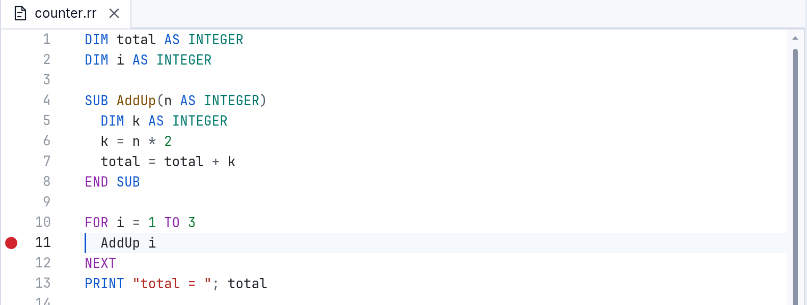

**Running to it.** Press **F5**. The program stops at line 11 before
calling `AddUp`:

- an arrow in the margin and a tinted line show where it is;
- the status bar turns orange: `Breakpoint: counter.rr:11`;
- **Variables** (bottom right) shows the values: `i = 1`, `total = 0`;
- **Call Stack** (bottom left, in the Toolbox's place while you debug)
  shows where the program is: `(the program)  counter.rr:11`.

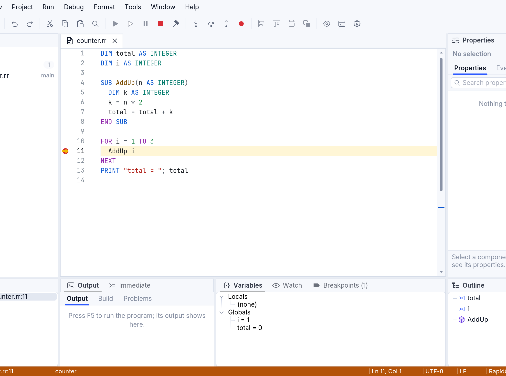

Press **F5** again: it goes on and stops at line 11 again, now with
`i = 2`. Press F5 twice more and the program ends.

Breakpoints work in every file of the project, also in files you
`$INCLUDE`; the file opens when the program stops in it.

**A line without code.** A breakpoint on a comment, a blank line or a
`DIM` moves to the next line that has code when the program runs, and
stops there. One after the last line of code can never stop; the
Breakpoints pane says `(no code here: never stops)` and its dot becomes a
ring.

**All of them.** The **Breakpoints** pane (next to Variables) lists every
breakpoint. Double-click one (or select it and press Enter) to see its
line; Delete removes it; Space switches it off and on. Debug ▸ Delete All
Breakpoints (Ctrl+Shift+F9) removes them all.

Studio keeps your breakpoints and watches with the project: close Studio,
open the project again, and they are there.

### Conditions, hit counts and log messages

Put the caret on the breakpoint's line and press **Shift+F9** (Debug ▸ Edit
Breakpoint), or select it in the Breakpoints pane. The boxes under the list
change what it does; type and press **Enter** to apply.

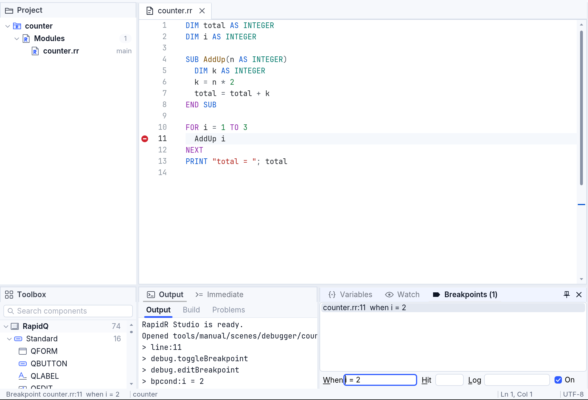

| Box | Example | Effect |
|---|---|---|
| When | `i = 2` | Stops only when the expression is true. |
| Hit | `3`, `>= 3`, `% 2` | Stops only the third time the line is reached, from the third time on, or every second time. |
| Log | `adding {i}: total is {total}` | Doesn't stop: prints the message in Output and goes on. Expressions in `{ }` are replaced by their values. |
| On | (check box) | Unchecked keeps the breakpoint but doesn't stop. |

With *When* set to `i = 2`, F5 stops at line 11 once, with `i = 2`.

A breakpoint with a log message is a quick way to follow a program without
adding PRINTs to it:

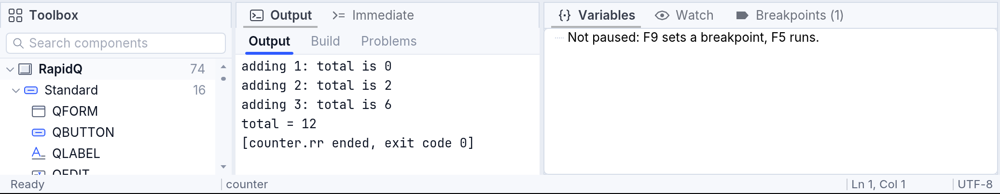

Each kind has its own mark in the margin: a red dot; a dot with a bar for a
condition or a hit count; a diamond for a log message; a ring when it's
off or can't stop.

## Stepping

While the program is paused:

| Key | Menu | What it does |
|---|---|---|
| F10 | Debug ▸ Step Over | Runs the line and stops at the next one. A SUB or FUNCTION the line calls runs whole. |
| F11 | Debug ▸ Step Into | Runs the line and stops at the next line that runs — inside a SUB or FUNCTION it calls, in another file too. |
| Shift+F11 | Debug ▸ Step Out | Runs to the end of the SUB or FUNCTION it's in and stops after the call. |
| Ctrl+F10 | Debug ▸ Run to Cursor | Runs to the line with the caret. |
| F5 | Debug ▸ Continue | Runs on to the next breakpoint, or the end. |

F8 also steps into and Shift+F8 steps over, as in Visual Basic. When the
program isn't running, F10 and F11 start it and stop at its first line, and
Run to Cursor starts it and stops at the caret's line.

Stopped at line 11, press **F11**: the program goes into `AddUp` and stops
at `k = n * 2`. Press **F10**: it stops at `total = total + k`. The Call
Stack now has two lines: `AddUp  counter.rr:7`, where the program is, above
`(the program)  counter.rr:11`, the line that called it. Variables shows
AddUp's own variables under **Locals** (`n = 1`, `k = 2`) and the program's
under **Globals**. The status bar's `Ln 7, Col 1` follows the program's line.

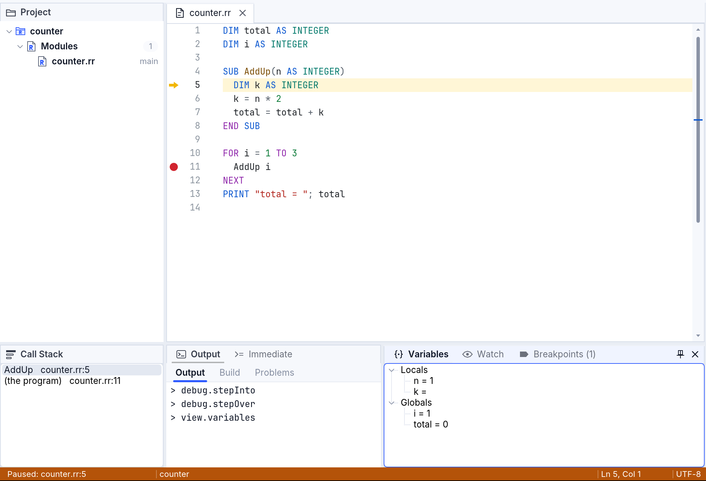

### Pausing a program that waits

A program with a form usually waits in `Form.ShowModal` for the user to do
something; no code runs. **Debug ▸ Pause** stops it at once, on the line
that waits, with the note *Waiting for events* beside it, and you can look
at its variables there. Try it with
`tools/manual/scenes/debugger/greeter.rr`:

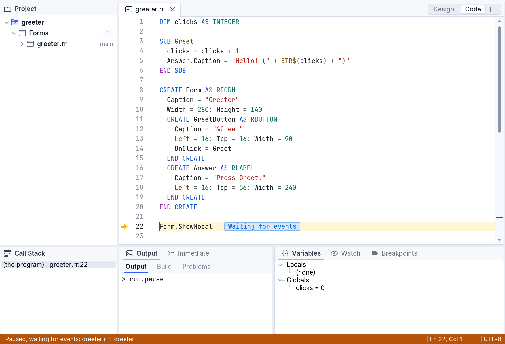

From there, **F5** lets it wait again. **F10** (Step Over) stops on the
line after `ShowModal` once the form is closed. **F11** (Step Into) stops
in the next event handler that runs: press Greet in the program's window
and Studio stops at the first line of `SUB Greet`.

While the program is paused its windows don't react: what you click and
its timers wait until it goes on.

## Looking at values

### Variables

The **Variables** pane shows **Locals** — the variables and parameters of
the SUB or FUNCTION where the program is paused — and **Globals**. Arrays,
TYPEs and components have a triangle: open it to see their elements,
fields or properties. In an event handler, open `Sender` to see the
component's properties as they are now. What you open stays open from one
stop to the next.

**Changing a value.** Select a value and press **F2** (or click it once
more after selecting it). Type the new value and press **Enter**; Escape
cancels. You can type any expression: `100`, `total * 2`, `"Hello"`. The
program goes on with the new value. This works for local and global
variables, array elements, TYPE fields and component properties.

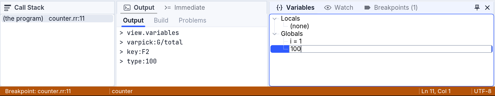

Set `total` to `100` at the first stop, remove the breakpoint (F9) and
press F5: Output shows `total = 112`.

### Watch

The **Watch** pane shows expressions you choose, worked out again at every
stop. Type one in the *Add a watch* box and press Enter — `total + k`,
`n * 100`, `UCASE$(Name$)`, `Form.Caption` — or put the caret on a word in
the code (or select an expression) and choose Debug ▸ Add Watch. F2 on a
watch changes its expression; Delete removes it.

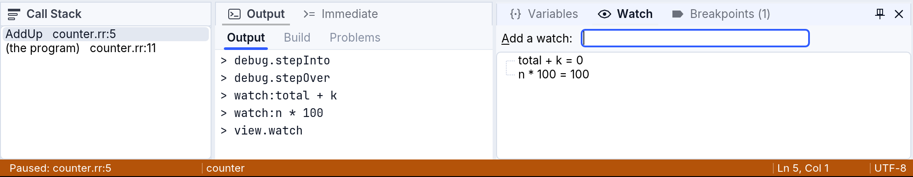

### Values under the mouse

While the program is paused, rest the mouse on a variable in the code: a
tip shows its value. Names with a dot work too, such as `Edit1.Text`.

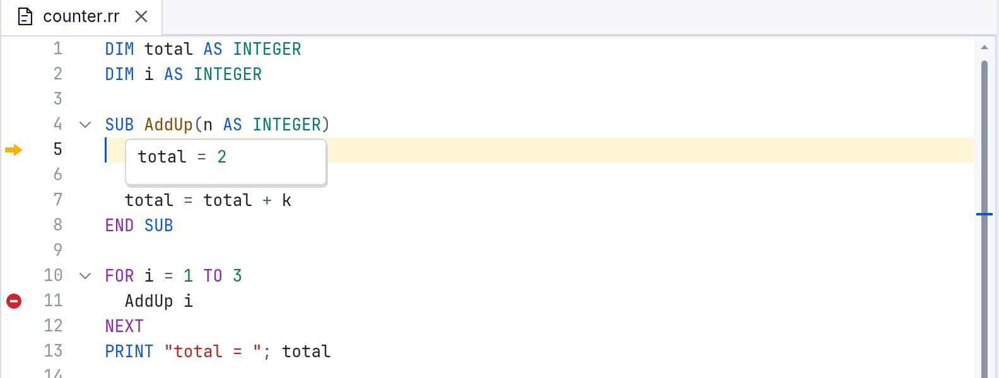

### The Call Stack

The **Call Stack** shows how the program got where it is: the SUB it is in
first, then the code that called it, down to the main program. When the
program first stops, the Call Stack takes the Toolbox's place at the bottom
left (you don't need the Toolbox while you debug); the Toolbox comes back
when the program ends. View ▸ Call Stack shows it at any time.

Click a line of the Call Stack to look at that caller: the editor shows its
line with a grey arrow, and Variables shows its locals.

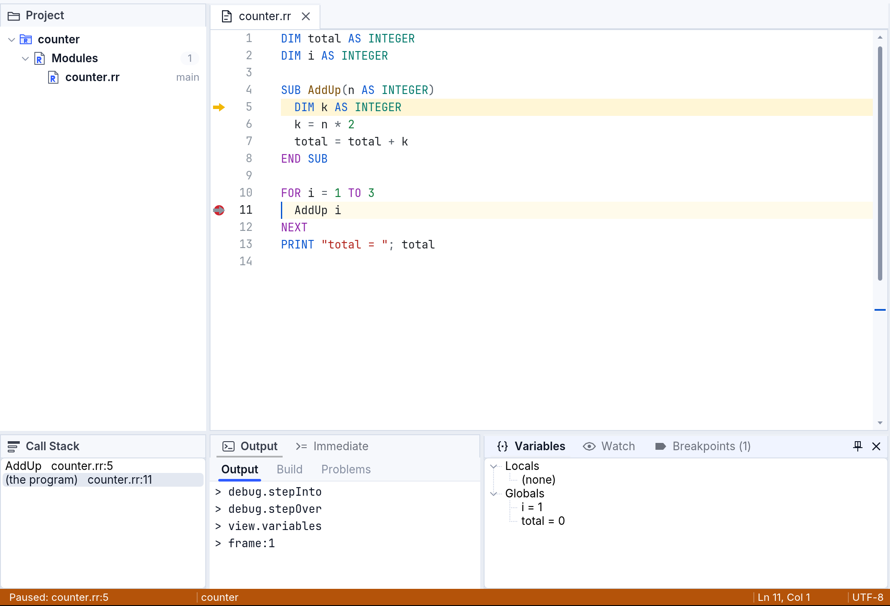

### The Immediate pane

**Immediate** (next to Output) runs what you type in the paused program.
Type a line and press **Enter**:

- `? expression` prints a value: `? total * 10` → `60`;
- anything else runs as a statement where the program is paused:
  `total = 0` changes `total`.

Up and Down bring back the lines you typed before.

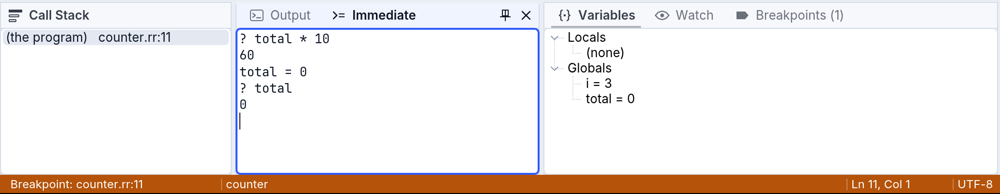

## When the program fails

When a run-time error happens — a division by zero, an index out of
range — Studio stops the program on the line that failed instead of
letting it end (Debug ▸ Stop at Run-time Errors, checked unless you change
it). The line turns red with the message at its end, and Variables and the
Call Stack show the values that led to it. The message is in Output too,
with the file and line: click it to go there. Press Shift+F5 to end the
program.

This program (`tools/manual/scenes/debugger/share.rr`) divides by a
variable that is still 0:

```basic
DIM people AS INTEGER

SUB Share(Amount AS INTEGER)
  PRINT "each gets "; Amount \ people
END SUB

PRINT "before"
Share 10
PRINT "after"
```

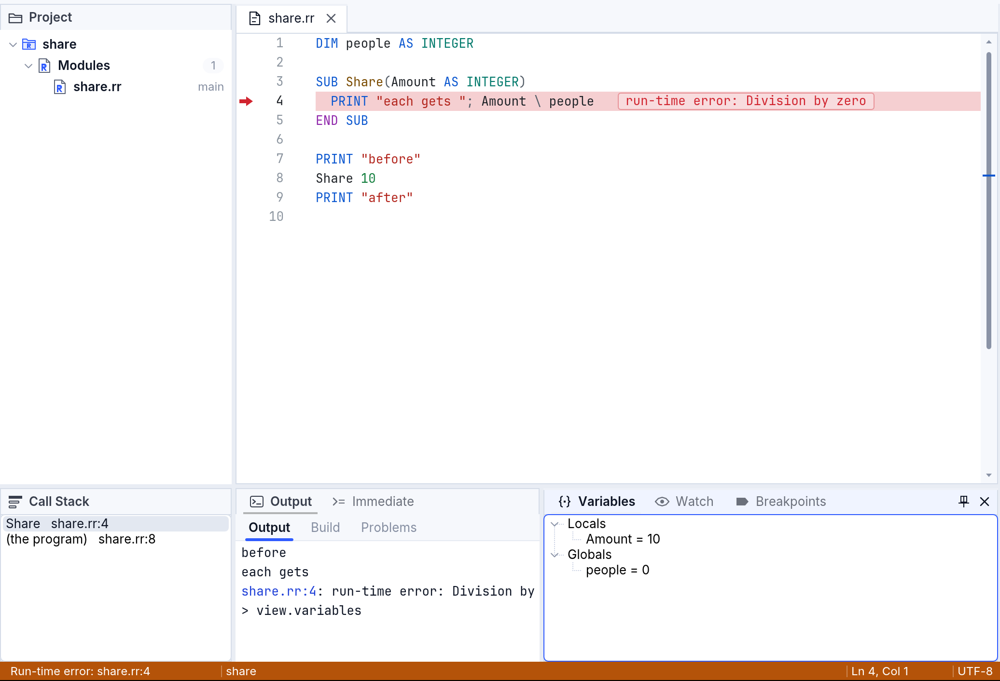

## On the desktop and in the browser

Everything on this page works the same in Studio on the desktop and in
Studio in the browser.

- **On the desktop** your program runs as a program of its own, with its
  own windows — as it will when you build it. Stop ends that program.

  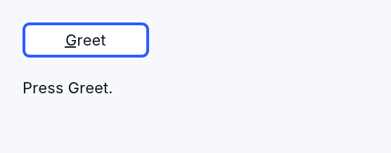

- **In the browser** your program runs inside the page. Its windows float
  over Studio; drag them anywhere on the page, even past Studio's own
  window, and nothing of them is cut off. A click beside them reaches
  Studio. Run ▸ Run in Browser isn't needed there: Run already runs the
  program in the page.

  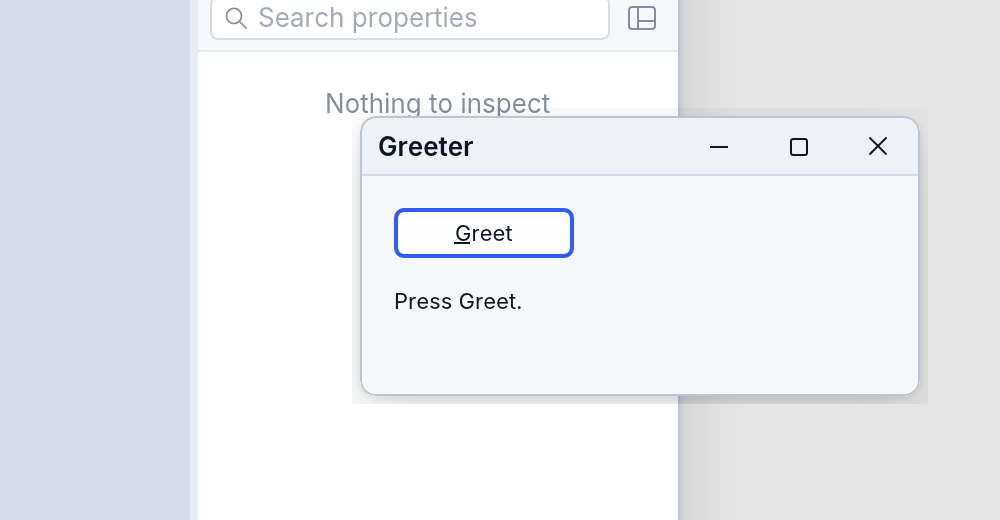

  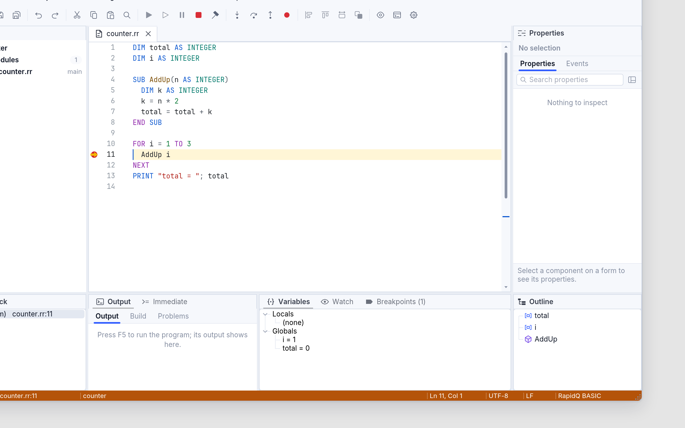

- The browser keeps some keys for itself (Ctrl+N, Ctrl+W, Ctrl+T): use the
  menus or the command palette for those commands.

## Not there yet

- Set Next Statement (moving the arrow to another line before going on).
- Completion while you type in the Immediate pane.
