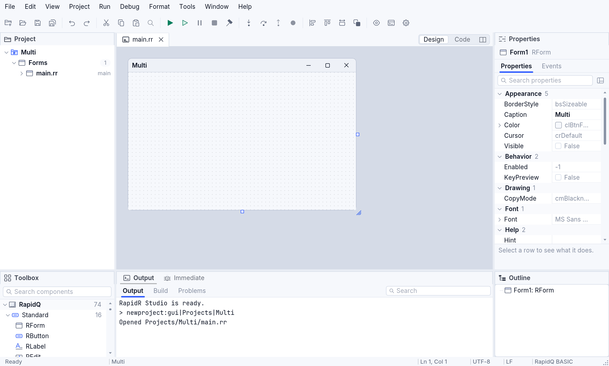
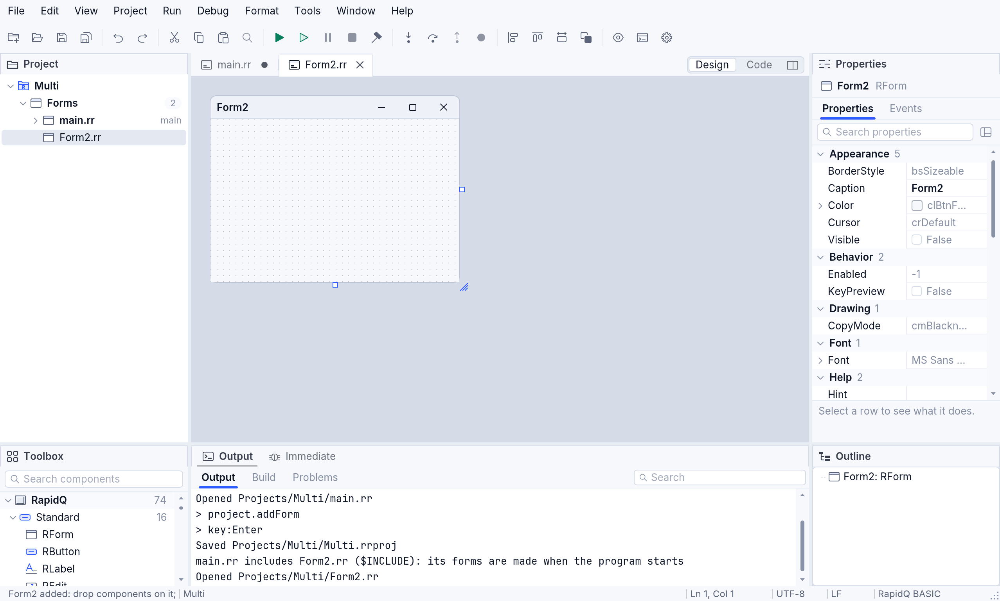
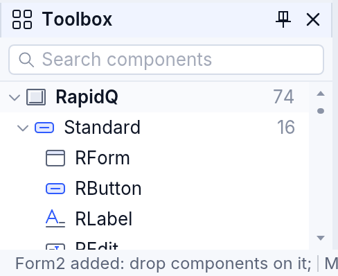
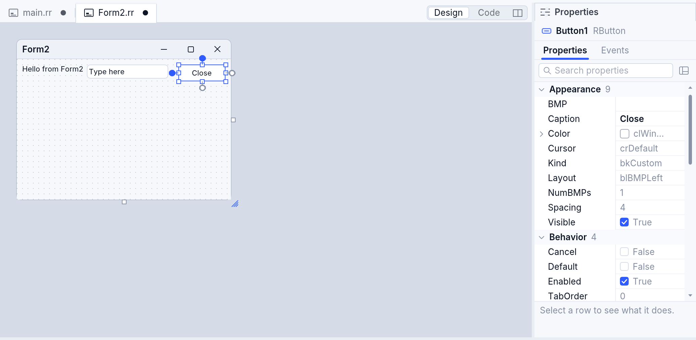
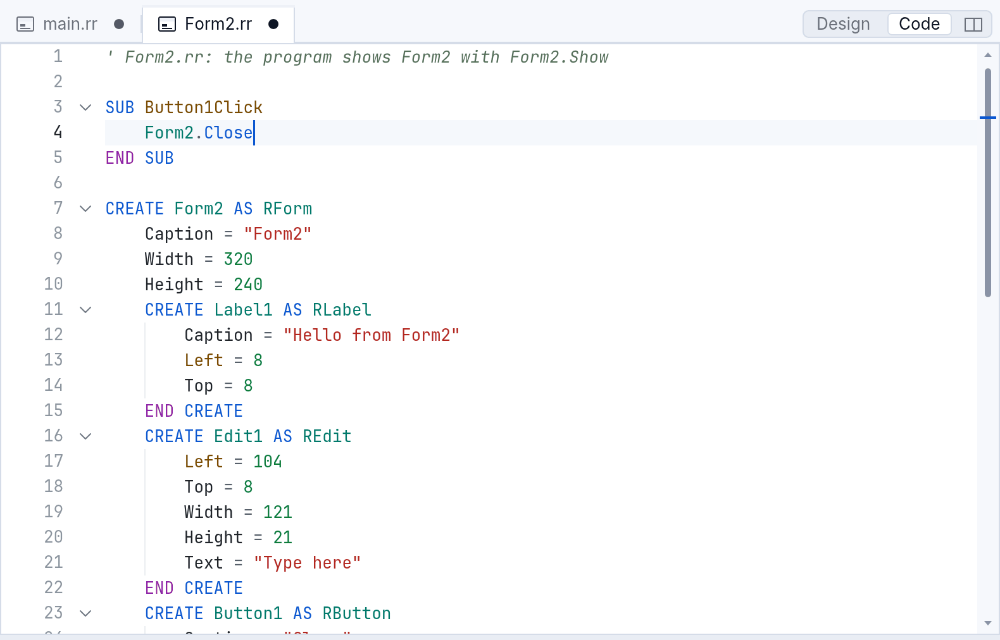
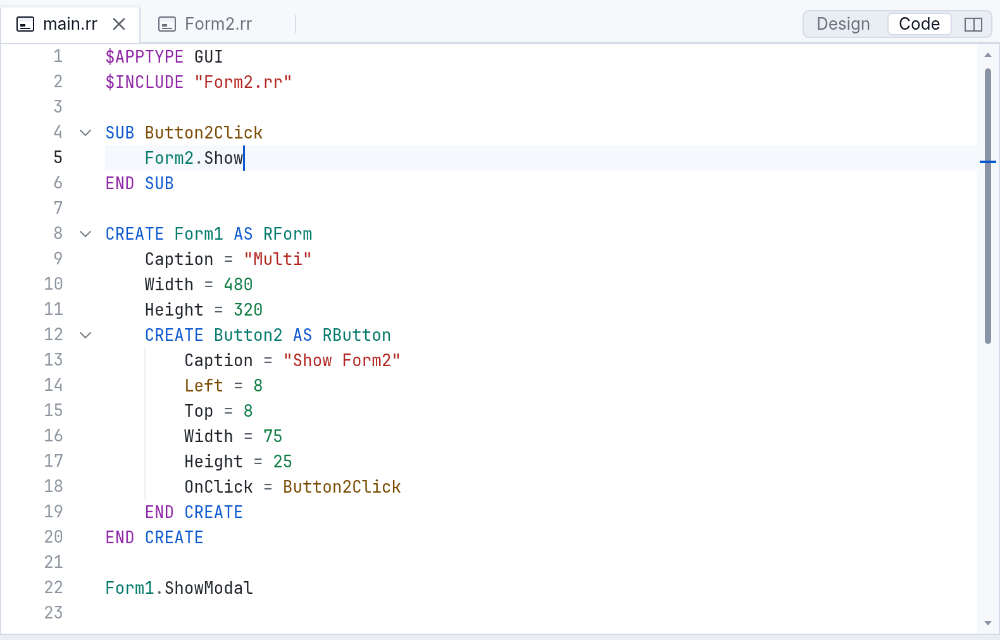
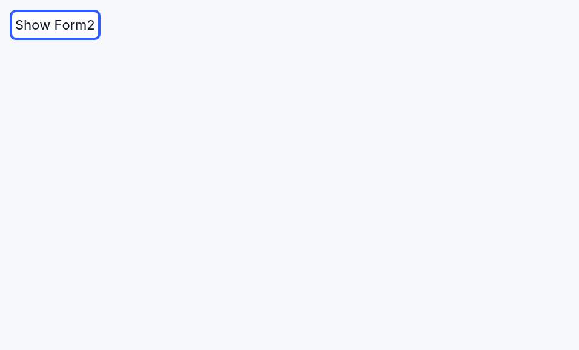
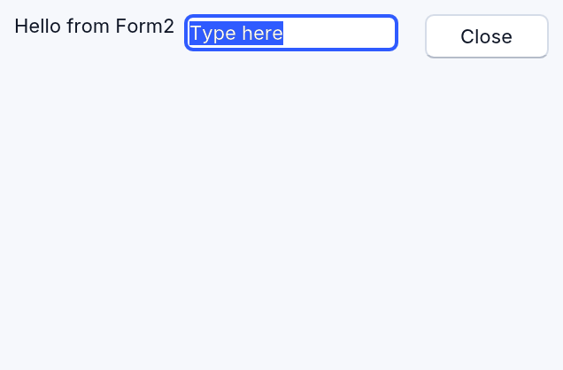

# Designing forms in RapidR Studio

RapidR Studio's form designer lets you build a program's windows by drawing
them: you put buttons, labels, text boxes and the rest on a form, set their
properties, and Studio writes the BASIC code for you — ordinary `CREATE …
END CREATE` blocks in your source file, the same code you would type by
hand. There is no hidden designer file: **the source is the form**. Change
the code and the designer follows; change the designer and only the lines
that need it change in the code.

This page starts with a tutorial — a program with two forms, from an empty
project to running it — then describes each part of the designer.

All pictures come from `tools/manual/shots.mjs` (scenes in
`tools/manual/scenes/designer.mjs`), so they show Studio as it is.

## Tutorial: your first two-form app

You will make a program whose main window has a button that opens a second
window, and a second window with a label, a text box and a **Close** button.

### 1. Make a project

Choose **File ▸ New Project** (Ctrl+N; ⌘N on a Mac), pick **Form app**, give
it a name — here `Multi` — and a folder, and press **Create**. Studio makes
the folder with two files, `main.rr` (the program) and `Multi.rrproj` (the
project), and opens `main.rr` on its designer: the form `Form1` sits on the
designer's grey canvas, as it will look when the program runs.



The window has four areas around the document: the **Project** tree (top
left), the **Toolbox** (bottom left), the **Properties** inspector (right)
and **Output** (bottom). Each document is a tab; a file that makes a form
has a **Design | Code** switch at the right of the tabs (and the button
beside it shows both side by side).

| To | Do |
|---|---|
| see the form | **Design** in the switch, or **View ▸ Designer** (Shift+F7) |
| see the code | **Code** in the switch, or **View ▸ Code** (F7) |
| switch between them | F12 (in the code, F12 on a name goes to where it is declared) |
| see both | the switch's third button, or **View ▸ Designer and Code Side by Side** |

### 2. Add a second form

Choose **Project ▸ Add Form** — or click **RForm** in the toolbox. The
project tree shows a new file, `Form2.rr`, with its name ready to edit: type
another name if you like, then press **Enter**.



Studio has done three things:

1. written `Form2.rr`:

   ```basic
   ' Form2.rr: the program shows Form2 with Form2.Show

   CREATE Form2 AS RForm
       Caption = "Form2"
       Width = 320
       Height = 240
   END CREATE
   ```

2. added it to the project (`Multi.rrproj`), and
3. made the program include it, at the top of `main.rr`:

   ```basic
   $APPTYPE GUI
   $INCLUDE "Form2.rr"
   ```

   That is how a RapidR (and RapidQ) program is made of several files:
   `$INCLUDE` puts the file's code where the line is, so `Form2` is created
   when the program starts — hidden, until the program shows it. The
   `$INCLUDE` is one undo step in `main.rr` (Ctrl+Z there takes it back).

**Project ▸ Add Module** works the same way for a file of SUBs and
FUNCTIONs without a form (`Module1.rr`).

### 3. Put components on Form2

The toolbox lists every component, grouped (Standard, Additional, Dialogs,
System …), under RapidR's names: RButton, RLabel, REdit and so on. Type in
its search box to find one by name or by what it does ("chart" finds
RPlot).



Add an **RLabel**, an **REdit** and an **RButton** to Form2 — any of these
ways works:

- **double-click** the item (or select it and press **Enter**): it goes to
  the first free place on the form, left to right, top to bottom, a grid
  step away from what is there;
- **click** the item, then click on the form where it goes — or drag on the
  form to draw it at the size you want;
- **drag** the item from the toolbox onto the form.

Each new component is named as Delphi and Visual Basic name them — Label1,
Edit1, Button1 — and is selected, so the inspector shows it.

### 4. Set their properties

With **Label1** selected, find **Caption** in the inspector, type
`Hello from Form2` and press Enter. Do the same for **Edit1**'s **Text**
(`Type here`) and **Button1**'s **Caption** (`Close`). Each change is
written into the code at once, as the smallest change: one line.



A label sizes itself to its caption (its **AutoSize** is on, as in RapidQ),
so the designer writes no width for it.

### 5. Make the button do something

Select **Button1**, open the inspector's **Events** page and double-click
**OnClick** (double-clicking the button on the form does the same: it makes
its default event's handler). Studio writes a SUB for it, binds it with
`OnClick = Button1Click` in the button's block, and puts the caret inside
the SUB. Type `Form2.Close`:



```basic
SUB Button1Click
    Form2.Close
END SUB

CREATE Form2 AS RForm
    …
    CREATE Button1 AS RButton
        Caption = "Close"
        Left = 240
        Top = 8
        Width = 70
        Height = 25
        OnClick = Button1Click
    END CREATE
END CREATE
```

The SUB goes before the form, where RapidQ needs it (a SUB is known from
the line it is written on), with the parameters RapidQ's event has.

### 6. Show Form2 from Form1

Open `main.rr` (its tab, or double-click it in the project tree), switch to
**Design**, add an **RButton** to Form1, set its Caption to `Show Form2`,
and make its OnClick handler as in step 5. Type `Form2.Show` in it:



The new button is **Button2**, not Button1: a RapidQ program's component
names are global (you write `Button1.Caption`, not `Form2.Button1.Caption`),
so the designer never gives a name another file of the program uses.

### 7. Run it

Press **F5** (**Run ▸ Run**). Studio saves every file first, checks the
whole program — `main.rr` and what it includes — and runs it. Click
**Show Form2**:




The same program runs on every RapidR runtime: interpreted, built as a
native executable (**Run ▸ Build**, Ctrl+Shift+B), and in a browser — Studio on the web
runs it in a frame beside your code.

## The toolbox

- Double-click (or Enter): adds the component at a free place in the
  selected container — the form, or the panel, group box or scroll box
  selected. A component larger than the form (a 640 × 480 RPlot on a small
  form) is made as large as fits.
- Click, then click or drag on the form: places it there (dragging draws its
  size).
- Drag onto the form: drops it where you let go, inside the container under
  the mouse; while you drag, guides show it lining up with the others.
- Components that aren't seen when the program runs — timers, dialogs,
  RStringList … — go to the **tray** under the form.
- **RForm** and **RFormMDI** are documents, not components: clicking them
  adds a form file (step 2); RFormMDI's is an MDI main window
  (`CREATE Form3 AS RFormMDI`). Dragging RForm onto a form doesn't put a
  form inside a form: it is added as a new window and the status bar says
  so. (RapidR doesn't show forms inside an RFormMDI yet; its child windows
  are components it adds with `AddChild`.)

The designer writes each file in its own names: RapidR's (RButton) in a file
written with them, RapidQ's (QBUTTON) in a RapidQ program — a file that
creates `QFORM`s, or a `.bas` file — never a mix. Both names mean the same
component.

## Selecting, moving and resizing

| To | Do |
|---|---|
| select | click it; Shift+click (⌘+click) adds or removes one; drag on the form's background draws a box around several |
| move | drag it (Alt while dragging: no snapping to the grid or guides); arrow keys move by a pixel, Shift+arrows by the grid |
| resize | drag one of its eight handles; Ctrl+arrows (⌘+arrows) by a pixel |
| resize the form | drag its right edge, bottom edge or corner |
| edit a caption in place | F2 (**Format ▸ Edit Caption**), or click the selected component again, slowly |
| go through the components | Tab / Shift+Tab; Esc selects the container |
| delete | Delete |
| copy, cut, paste, duplicate | Ctrl+C, Ctrl+X, Ctrl+V, Ctrl+D (⌘ on a Mac) — the clipboard holds the CREATE text, so pasting in the code gives the code |
| undo, redo | Ctrl+Z, Ctrl+Y (⌘Z, ⌘⇧Z) |

Undo is **one history per file**, shared with the code editor: what you did
in the designer and what you typed in the code are undone in the order you
did them, back to the file's exact bytes.

**Format** lines up the selected components with the first one you
selected: **Align Lefts / Rights / Tops / Bottoms / Centers / Middles**,
**Make Same Width / Height / Size**, **Space Evenly Across / Down**,
**Center Horizontally / Vertically** (in the form), **Bring to Front**,
**Send to Back**. Each is one undo step.

## The inspector

The **Properties** page lists what you can set on the selected component
(or on the form itself when nothing is selected), by category or A–Z, with a
search box; the box under it says what the selected property does. Values
in grey are defaults: not written in the code.

Each kind of property has its own editor, and each writes what the program
needs:

| Kind | Example | Written as |
|---|---|---|
| text | Caption `Say hi && bye` | `Caption = "Say hi && bye"` (`&` underlines the next letter; `&&` is an `&`) |
| true / false | WordWrap ☑ | `WordWrap = 1` |
| a choice | Alignment `taCenter` | `Alignment = taCenter` — or `Alignment = 2` (see below) |
| colour | Color `clYellow` | `Color = clYellow` — or `Color = &H00FFFF` |
| font | Font ▸ Name `Arial`, Size `12`, Bold ☑, Color `clBlue` | `Font.Name = "Arial"`, `Font.Size = 12`, `Font.Bold = 1`, `Font.Color = …` |
| number | Width `120` | `Width = 120` |

RapidQ's named constants — `clYellow`, `taCenter`, `alClient` … — come
from `RAPIDQ.INC`. In a program that doesn't `$INCLUDE "RAPIDQ.INC"` (or
define them), a name would read as nothing when it runs, so the designer
writes the number instead.

The **Events** page lists the component's events (the form's when nothing
is selected: OnShow, OnClose, OnResize, OnPaint, OnKeyDown …).
Double-click one to make its handler — a SUB named after the component and
the event (`Button1Click`, `Form1Show`) — or to go to it when there is one;
the list also offers the SUBs of the file that fit.

## The menu editor and the Tab order

- **Format ▸ Menu Editor** edits the form's menu bar on the form itself:
  type on **Type Here** to make a menu, Enter to go into it; `&` marks the
  letter Alt reaches, `-` is a separator; in an item's ShortCut box press
  the keys (Ctrl+O). Each item is a `CREATE … AS RMenuItem` block.
- **Format ▸ Tab Order** shows each component's place in the Tab order;
  click them in the order you want.

## Zoom

**View ▸ Zoom In / Zoom Out / Actual Size / Zoom to Fit**, Ctrl+= / Ctrl+− /
Ctrl+0 (⌘ on a Mac), Ctrl+wheel or a trackpad's pinch: 25 % to 400 %. The
form's pixels in the program don't change. When the form is larger than the
designer, scroll bars let you reach all of it.

## Programs of several forms

- Every form or module of the program is a file the main file includes:
  **Project ▸ Add Form / Add Module** writes the `$INCLUDE` for you (after
  the last `$INCLUDE`, so a later file can use what an earlier one makes).
- Show a form with `Form2.Show`, or `Form2.ShowModal` to wait until it
  closes; hide it with `Form2.Close` or `Form2.Visible = 0`.
- Component names are global: Form1 can use Form2's `Edit1.Text` directly.
- In a form's file, Studio knows the whole program: the names of the main
  file and the other forms are completed and checked there.
- Rename a file in the project tree (F2) and the `$INCLUDE` follows it;
  take it out of the project (Delete) and its `$INCLUDE` goes too (the file
  stays on the disk).
- In a RapidQ program (`main.bas`), new forms and modules are `.bas` files
  and use RapidQ's names, so RapidQ's own compiler can build it too.

## The code the designer writes

Everything the designer writes is the BASIC you would write: `CREATE …
END CREATE` blocks, one property a line, `OnClick = Handler` for an event,
plain `SUB`s. It changes only what it must — opening a file and saving it
without a change gives the same bytes; moving a button changes its `Left`
line and nothing else; your comments, blank lines and formatting stay.
Code you write inside a CREATE block that the designer can't edit (an
expression such as `Width = Screen.Width / 4`) stays as you wrote it.
While the code has an error, the designer shows the form as it last
compiled and changes nothing until you fix it.
