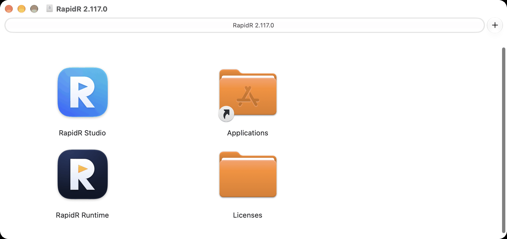
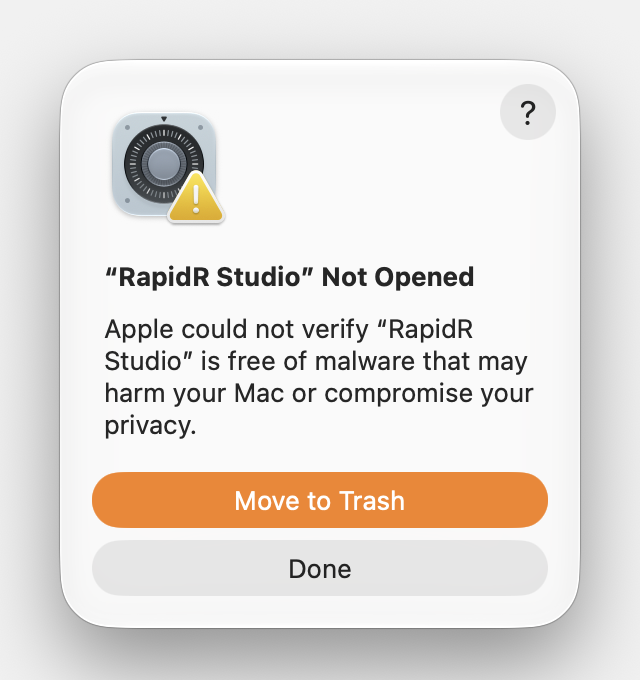
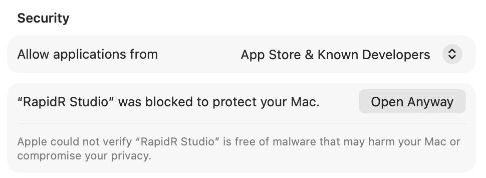
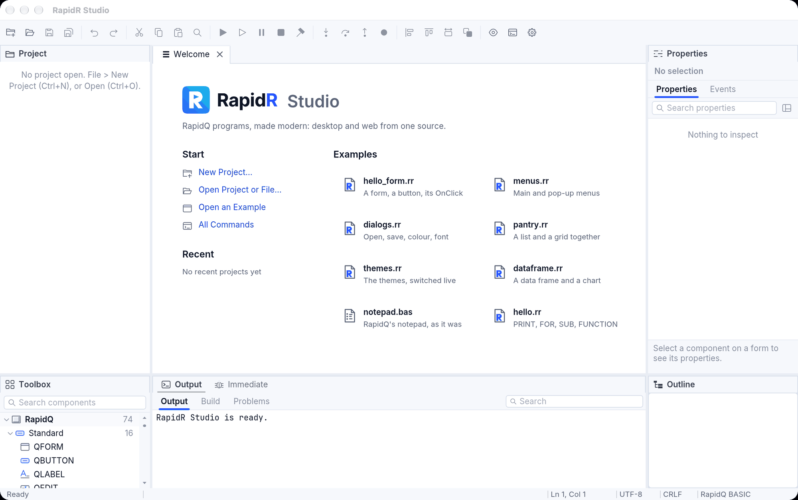
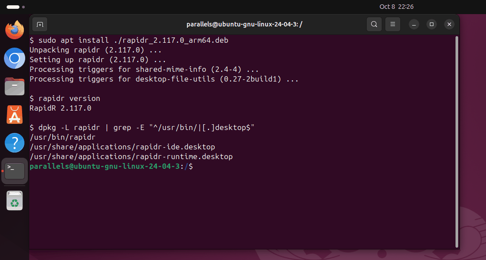
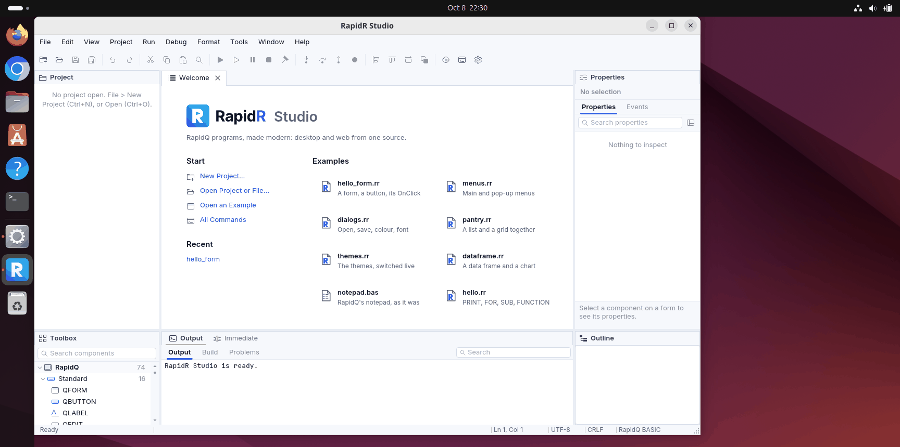
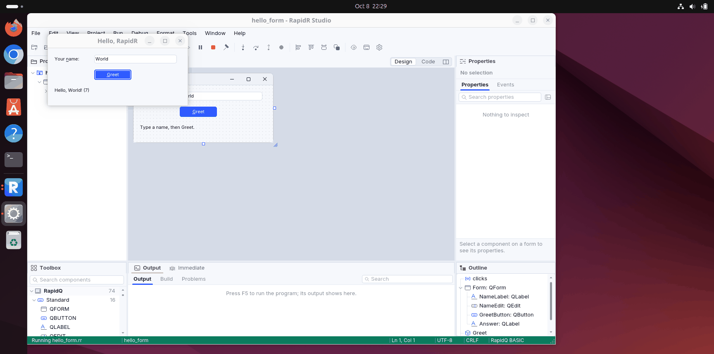

# Getting started

## Install

Download from [the GitHub releases](https://github.com/iBobX/RapidR/releases).
There are two kinds of package for each system:

- **The RapidR SDK**: the IDE, the `rapidr` command (compiler and runtime),
  everything needed to make standalone executables and web bundles, and
  RapidR's runtime sources for native builds. Install this to write programs.
- **The RapidR Runtime**: only runs RapidR programs, and RapidQ programs, which RapidR runs
  unchanged (`.rrbc`, `.rr`, `.bas`, `.rqw`, `.rqb`, `.rq`), like a Java runtime. Install this on machines that only
  run programs someone gave you.

The SDK includes the Runtime. Installs are per user and need no
administrator rights (except the Linux `.deb` packages, which install
system-wide).

| System | SDK | Runtime only | Minimum |
|---|---|---|---|
| Windows x64 / ARM64 | `RapidR-2.117.0-windows-<x64\|arm64>-setup.exe` | `RapidR-Runtime-2.117.0-windows-<arch>-setup.exe` | Windows 10 or 11 |
| macOS (one universal app: Apple silicon and Intel) | `RapidR-2.117.0-macos-universal.dmg` | `RapidR-Runtime-2.117.0-macos-universal.dmg` | macOS 11 Big Sur |
| Linux x86_64 / aarch64 | `rapidr-2.117.0-linux-<arch>.tar.gz` or `rapidr_2.117.0_<amd64\|arm64>.deb` | `rapidr-runtime-…` | Ubuntu 22.04, Debian 12 or newer (OpenSSL 3) |
| Web | `rapidr-web-2.117.0.zip`: the web IDE, for any static web host | | a current browser |

**This first release is not code-signed.** Apple and Microsoft check
downloaded programs against a list of registered publishers, and RapidR is
not on it yet, so Windows and macOS each warn once the first time you open
it. The warning is expected, and the steps to get past it are below (one per
system). The files are the same ones whose checksums are published; see
[Check your download](#check-your-download) to prove it.

### Install on Windows

1. **Pick the right file.** *Settings > System > About > System type* says
   "x64-based processor" (take `RapidR-2.117.0-windows-x64-setup.exe`) or
   "ARM-based processor" (take `…-windows-arm64-setup.exe`; Windows 11 in a
   Mac's virtual machine is ARM). To only run programs, take the
   `RapidR-Runtime-…` file of the same kind.
2. **Run the installer.** Double-click it. It installs for you alone, into
   `%LOCALAPPDATA%\Programs\RapidR`, and never asks for an administrator
   password.
3. **Get past SmartScreen** (the first time only). Windows shows **Windows
   protected your PC** and a blue **More info** link. Click **More info**: the
   publisher reads "Unknown publisher" and a **Run anyway** button appears.
   Click it.
4. **Accept the licence**, read the legal notes, and click **Next**. On the
   "Select Additional Tasks" page, leave *Add rapidr to PATH* ticked (it makes
   `rapidr` work in any Command Prompt or PowerShell window you open
   afterwards). Tick *Open .bas files with RapidR by default* only if RapidR
   should open your RapidQ `.bas` files when you double-click them.
   `.rrbc`, `.rr` and `.rrproj` files always belong to RapidR.
5. **Click Install, then Finish.**

Open the Start menu, type "RapidR" and press Enter: **RapidR Studio** starts.
In a new Command Prompt, `rapidr version` prints `RapidR 2.117.0`.

To remove RapidR: *Settings > Apps > Installed apps*, "RapidR 2.117.0",
**Uninstall**. The files, the Start menu entry, the file types and the PATH
entry go; your programs stay. The SDK and the Runtime use the same folder and
the same uninstall entry, so a PC has one of them: installing the other
replaces it.

### Install on macOS

1. **Open the disk image** (`RapidR-2.117.0-macos-universal.dmg`; one file for
   Apple silicon and Intel Macs, macOS 11 or newer). Drag **RapidR Studio**
   onto **Applications**. (The Runtime image holds only **RapidR Runtime**.)
   The *Licenses* folder in the image has the licence and the notices.

   

2. **Open RapidR Studio** from Applications. The first time, macOS refuses:
   “RapidR Studio” Not Opened, *Apple could not verify “RapidR Studio” is free
   of malware…*. Click **Done**. (Don't click *Move to Trash*.)

   

3. **Allow it, once.** Open **System Settings > Privacy & Security** and scroll
   down to *Security*. It says “RapidR Studio” was blocked to protect your
   Mac, with an **Open Anyway** button. Click it and confirm with your
   password or Touch ID. If you don't see the button, open the app again
   first (it appears after a refused attempt).

   

   On current macOS (15 Sequoia and newer), right-clicking the app and
   choosing *Open* no longer gets past this: **Open Anyway** is the way.
   Prefer the Terminal? This does the same:

   ```sh
   xattr -dr com.apple.quarantine "/Applications/RapidR Studio.app"
   ```

4. **RapidR Studio opens.** It is a normal Mac app from now on.

   

The `rapidr` command line is inside the app. Run it once to offer a link in
your PATH: `/Applications/RapidR Studio.app/Contents/MacOS/rapidr setup`.
Programs you build with `rapidr build` are signed ad hoc, so they open on the
Mac that built them without any of this.

To remove RapidR: drag **RapidR Studio** (and **RapidR Runtime**) from
Applications to the Trash. Settings and recent files stay in
`~/Library/Application Support/RapidR`: delete that folder too to leave no trace.

### Install on Ubuntu or Debian (the .deb package)

The `.deb` is the install for Ubuntu 22.04 or newer and Debian 12 or newer.
It is system-wide, so it asks for your password (`sudo`). Nothing warns about
it: Linux doesn't check publishers.

1. **Pick the right file.** `dpkg --print-architecture` prints `amd64` (most
   PCs: `rapidr_2.117.0_amd64.deb`) or `arm64` (Raspberry Pi 4 and 5, ARM
   servers, Ubuntu in a Mac's virtual machine: `rapidr_2.117.0_arm64.deb`). To
   only run programs, take `rapidr-runtime_2.117.0_<arch>.deb`.
2. **Install it with apt**, from the folder you downloaded it to. Keep the
   `./` in front of the name: it tells apt this is a file, and apt then
   fetches what RapidR needs (OpenSSL 3, fontconfig, ALSA) by itself:

   ```sh
   cd ~/Downloads
   sudo apt install ./rapidr_2.117.0_arm64.deb
   ```

   

3. **Open RapidR Studio**: *Show Applications*, type "RapidR", click **RapidR
   Studio** (it is under Development too), or run `rapidr ide`.

   

4. **Run an example.** On the Welcome page click **hello_form.rr**, then press
   **F5** (Run). The example's window opens beside Studio.

   

In the file manager, a double-click on a compiled `.rrbc` program runs it, and
a `.rr`, `.bas` or `.rrproj` file opens in RapidR Studio.

What the package puts where: the `rapidr` command in `/usr/bin`; RapidR's other
files (the runtime's sources for native builds, the IDE, a few example
programs) in `/usr/lib/rapidr`; the licence, the notices and this manual
(`manual/`) in `/usr/share/doc/rapidr`; the menu entry, file types and icons in
the system's usual places.

The SDK package (`rapidr`) and the Runtime package (`rapidr-runtime`) are
alternatives: installing one removes the other, because both provide the
`rapidr` command. To remove RapidR entirely, with nothing left behind:

```sh
sudo apt remove rapidr
```

If you would rather not use `sudo`, the `.tar.gz` installs under your own
folder: unpack it and run `./install.sh` (into `~/.local`; the folder also
works as it is: `bin/rapidr`). `~/.local/lib/rapidr/uninstall.sh` removes it.

### Check your download

Every release lists the SHA-256 of every file in **`SHA256SUMS`**. A match
proves the file is the one RapidR published, whole and unchanged. Download
`SHA256SUMS` into the same folder as the installer, then:

```sh
# macOS
shasum -a 256 -c SHA256SUMS --ignore-missing

# Linux
sha256sum -c SHA256SUMS --ignore-missing
```

Each file you have prints `OK` (the files you didn't download are skipped).
On Windows (PowerShell), print the file's checksum and compare it with its
line in `SHA256SUMS`:

```powershell
Get-FileHash .\RapidR-2.117.0-windows-x64-setup.exe -Algorithm SHA256
```

When a release also has **`SHA256SUMS.minisig`**, it proves the list itself
came from RapidR's author (checksums only prove the file matches the list).
Install [minisign](https://jedisct1.github.io/minisign/) (macOS: `brew install
minisign`; Ubuntu: `sudo apt install minisign`; Windows: `winget install
jedisct1.minisign`) and run it with the public key printed in that release's
notes:

```sh
minisign -Vm SHA256SUMS -P <the public key from the release notes>
```

It says `Signature and comment signature verified` when the list is genuine.

### Rust, only for native builds

Running programs, the IDE, standalone interpreted executables and web
bundles need nothing else. **Native builds** (your program compiled to
machine code) compile with Rust:

```sh
rapidr setup            # asks first; --yes to agree, --check to only report
```

- With rustup already installed, it adds the exact Rust version RapidR was
  tested with (`1.98.1`) *beside* yours. It never changes your default
  toolchain, never updates or removes one.
- With no Rust at all, it installs rustup (into `~/.cargo` and `~/.rustup`)
  after saying so and asking.
- With a Rust that isn't rustup's, it reports it and changes nothing.
- On Windows the SDK ships its own linker (LLVM-MinGW): no Visual Studio
  needed. On macOS native release builds are universal when both Rust
  targets are installed (`rapidr setup` adds them).
- It also offers to put `rapidr` on your PATH.

Native builds then work offline: the SDK carries the runtime's sources and
every crate they need.

## Your first program

Save this as `hello.bas` (`.rr` works the same):

```basic
PRINT "Hello, World!"
DIM name AS STRING
name = "RapidR"
PRINT "Hi from "; name
```

Run it with the interpreter:

```sh
rapidr run hello.bas
```

```
Hello, World!
Hi from RapidR
```

Or open it in the IDE (`rapidr ide hello.bas`, or double-click it) and press
Run.

## A window

```basic
' A window with a button and a label
DECLARE SUB ButtonClick (Sender AS RButton)

CREATE Form AS RForm
    Caption = "Hello"
    Width = 320
    Height = 160
    Center
    CREATE Label1 AS RLabel
        Caption = "Not clicked yet"
        Left = 20
        Top = 20
    END CREATE
    CREATE Button1 AS RButton
        Caption = "Click me"
        Left = 20
        Top = 60
        OnClick = ButtonClick
    END CREATE
END CREATE

SUB ButtonClick (Sender AS RButton)
    Label1.Caption = "Clicked!"
END SUB

Form.ShowModal
```

`rapidr run form.bas` opens the window; closing it ends the program.

### RapidR's names and RapidQ's names

RapidR writes its components `RForm`, `RButton`, `RLabel`, `REdit`,
`RStringGrid` …, and RapidR Studio, the examples and this manual use these
names. RapidQ programs write `QFORM`, `QBUTTON`, `QLABEL` …: **RapidR
accepts those too, silently, with no setting** — `QFORM` and `RForm` are the
same component, and you can mix them:

```basic
DIM Old AS QBUTTON      ' RapidQ's name
DIM New AS RButton      ' RapidR's name: the same component
```

The rule is simply Q → R (`QBUTTON` is `RButton`); a few differ: `QGAUGE` is
`RProgressBar`, `QOUTLINE` is `RTreeView`, `COMPORT` is `RComPort`. The full
list: [reference/components.md](reference/components.md). To turn a RapidQ
program into one with RapidR's names, see
[Importing RapidQ programs](importing-rapidq.md). A program that uses RapidQ's constants (`clRed`,
`MB_OK` …) keeps the line `$INCLUDE "RAPIDQ.INC"`: RapidR supplies them
through that line without needing the file.

## Building

| You want | Command | Needs |
|---|---|---|
| Run a program now | `rapidr run prog.bas` | nothing |
| A compiled program for the RapidR Runtime | `rapidr build-bc prog.bas -o prog.rrbc` | nothing |
| A standalone executable (the interpreter inside) | `rapidr build prog.bas --interp` | nothing |
| …for the other Windows architecture, or one macOS slice | `rapidr build prog.bas --interp --target windows-aarch64` | nothing (the SDK ships those runners) |
| A native executable | `rapidr build prog.bas` | Rust (`rapidr setup`) |
| A web bundle (a `.zip` for any static host) | `rapidr bundle-bc prog.bas -o prog-web.zip` | nothing |

Every build writes `THIRD-PARTY-NOTICES.txt` beside the executable (or into
the web bundle). Ship it with your program: it is all the licences of the
components inside ask for ([LEGAL.md](../../LEGAL.md)).

- An interpreted executable is the shipped interpreter with your program
  appended: no Rust needed, the same behaviour as `rapidr run`. On macOS it
  is universal by default.
- A native build translates the program to Rust and compiles it: the
  fastest programs and the smallest executables. `rapidr build prog.bas`
  is the optimized release build, the one you ship; `--debug` compiles
  quicker for debugging. The output folder gets only the app: the
  generated Rust is deleted after the build unless you ask for it
  (`--keep-rust`, or Studio's Project Options).
- Native and interpreted builds behave the same: the conformance suite runs
  every case both ways, and on the web.

Details: [The CLI and the RapidR Runtime](cli-and-runtime.md).

## The web

```sh
rapidr bundle-bc form.bas -o form-web.zip
unzip form-web.zip -d form-web
python3 -m http.server -d form-web 8080      # any static web server
```

Open `http://localhost:8080`: the same window, drawn by the same UI kernel
in a canvas. See [The web](web.md).

## The IDEs

- **The desktop IDE** (SDK: Start menu > RapidR Studio, *RapidR Studio* in
  Applications on macOS, *RapidR Studio* in the applications menu on Linux, or
  `rapidr ide [file]`) is written in RapidR
  itself: a form designer, a code editor with BASIC colours, Run. It is an
  early version; the full IDE (RapidR Studio: IntelliSense, a debugger,
  linked data components, AI assistance) is being built
  ([docs/ide-plan.md](../ide-plan.md)). Its debugger works today:
  [Debugging in RapidR Studio](debugging.md).
- **The web IDE** (`rapidr-web-2.117.0.zip`, any static host): RapidR
  Studio in the browser — the designer, the code editor and Run — with no
  server-side code (apps and web bundles are built on the desktop for now).

## Where next

- [The language](language.md), with the rules that surprise people coming
  from other BASICs (PRINT's comma, numbers, integer stores).
- [The examples](../../examples/README.md).
- [The component reference](reference/components.md), for every component's
  members.
