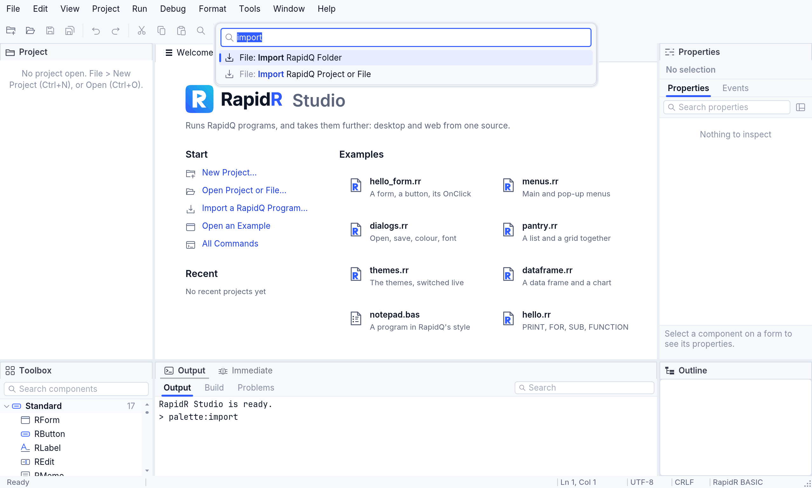
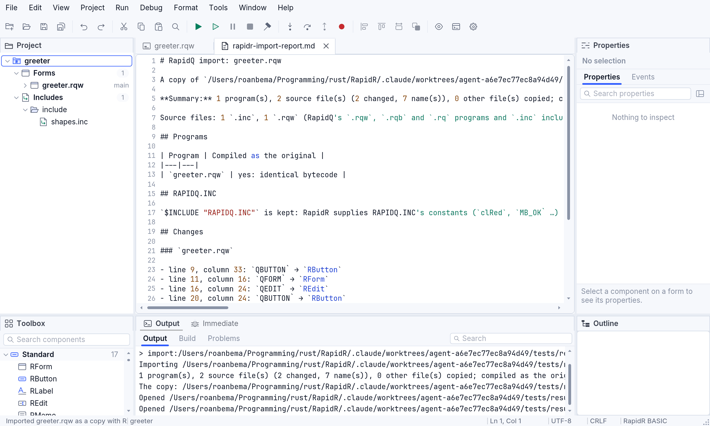
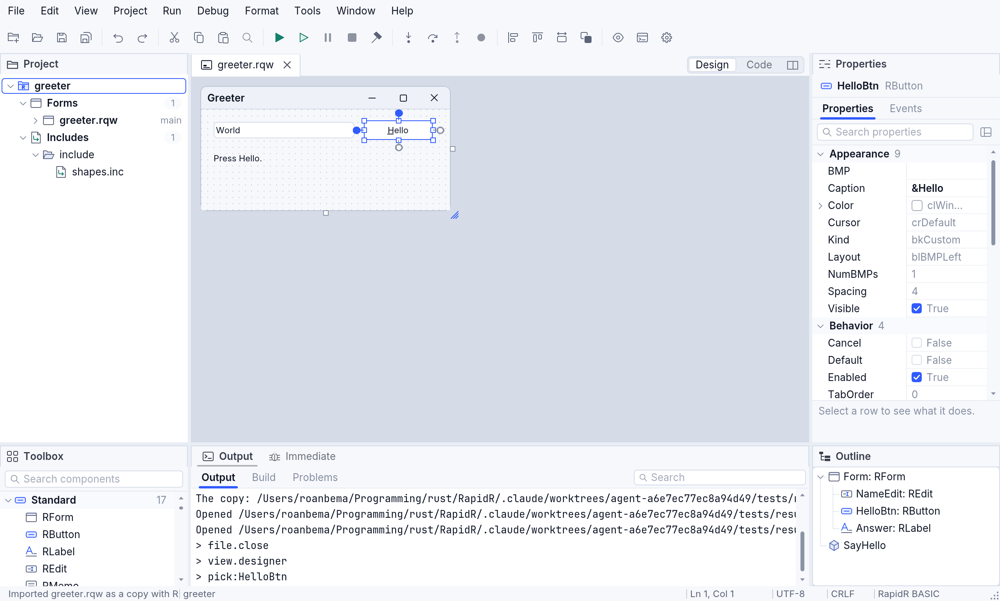

# Importing RapidQ programs

RapidR runs RapidQ programs **as they are**: you don't have to import
anything to run, build or edit one. Importing is for when you want a program
to use **RapidR's own names** (`RButton` instead of `QBUTTON`) from now on.

Importing always works on a **copy**. Your original files are only read,
never changed.

## What an import does

- It copies the program — the main file, every file it `$INCLUDE`s, and
  (for a folder) everything else in the folder — into a new folder beside
  it, named `<name>-rapidr`.
- In the copy, it changes **component names only**: `QFORM` becomes
  `RForm`, `QBUTTON` becomes `RButton`, `QGAUGE` becomes `RProgressBar`, and
  so on. Nothing else changes: not your code, not strings, not comments, not
  your own names (`QButtonCount` stays as it is), not your own TYPEs.
- It **proves** the copy behaves the same: the original and the copy are
  both compiled, and the results must be identical, byte for byte. The
  report says so for every program.
- It writes a report, `rapidr-import-report.md`, beside the copy: every
  name it changed (file, line, column) and anything it left alone, and why.
- `$INCLUDE "RAPIDQ.INC"` stays: RapidR supplies RapidQ's constants (`clRed`,
  `MB_OK` …) through that line, without the file.

Before and after, for a small program:

```basic
' greeter.rqw, as written for RapidQ          ' the copy, greeter-rapidr/greeter.rqw
DECLARE SUB SayHello (Sender AS QBUTTON)       DECLARE SUB SayHello (Sender AS RButton)
CREATE Form AS QFORM                           CREATE Form AS RForm
    CREATE NameEdit AS QEDIT                       CREATE NameEdit AS REdit
    END CREATE                                     END CREATE
    CREATE HelloBtn AS QBUTTON                     CREATE HelloBtn AS RButton
        Caption = "&Hello"                             Caption = "&Hello"
        OnClick = SayHello                             OnClick = SayHello
    END CREATE                                     END CREATE
END CREATE                                     END CREATE
```

## Which files

You can import one file — `.bas`, `.rqw`, `.rqb`, `.rq` (the extensions
RapidQ's editors saved programs with) or an `.inc` — or a whole folder, or a
RapidR project (`.rrproj`). Each file keeps its extension in the copy. You
don't need to import `.rqw`, `.rqb` or `.rq` files to use them: RapidR and
RapidR Studio open, run and build them directly.

## In RapidR Studio

1. Choose **File ▸ Import RapidQ Project or File…** to pick a file, or
   **File ▸ Import RapidQ Folder…** to pick a folder. The Welcome page has
   the same command: **Import a RapidQ Program…**. In the command palette
   (**Ctrl+Shift+P**, **⌘⇧P** on a Mac) type `import`.
2. Studio writes the copy beside the original (`greeter-rapidr`; if that
   folder exists, `greeter-rapidr-2` and so on) and says in **Output** how
   many names changed and that each program compiles exactly as before.
3. The copy opens as a project: its files in **Project**, its main file in
   the editor, and the report in a tab beside it.





In the copy, the designer, the toolbox, the inspector and the outline all
show RapidR's names, and the code says them too:



In the browser, RapidR Studio imports the same way: pick the file or folder
(its files are read into the page), and the copy is written beside it in the
page's storage.

## From the command line

```sh
rapidr import-rapidq greeter.rqw                 # the copy in greeter-rapidr/
rapidr import-rapidq greeter.rqw converted       # the copy in converted/
rapidr import-rapidq my-folder                   # a whole folder
rapidr import-rapidq prog.bas --include C:\RapidQ\include   # where RapidQ's includes are
```

It prints a summary and the report's path. `rapidr upgrade-names file.rr`
does the same to one of **your own** files in place (`--dry-run` shows the
changes first).

## Good to know

- **Names you mix are fine.** RapidR reads `QBUTTON` and `RButton` as the
  same component, always, without any setting — in old and new files alike
  (see [Components](components.md#rapidqs-names)).
- **When you add to a file, Studio follows its style.** In a file written
  with RapidQ's names, the designer adds `QBUTTON` and completion offers
  RapidQ's names, so the file never mixes them; elsewhere, RapidR's names.
- **What isn't converted**, and is listed in the report: names in an
  `$IFDEF` branch your build doesn't compile, names a `$DEFINE` makes, and
  includes that weren't found (point `--include` at RapidQ's include folder).
- RapidQ's own `.tpl` IDE templates aren't copied.
