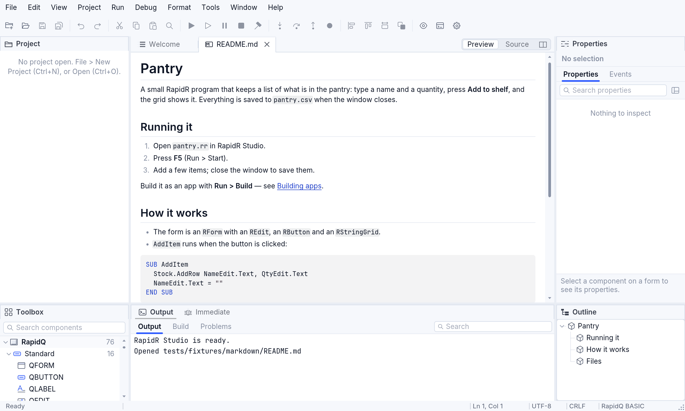
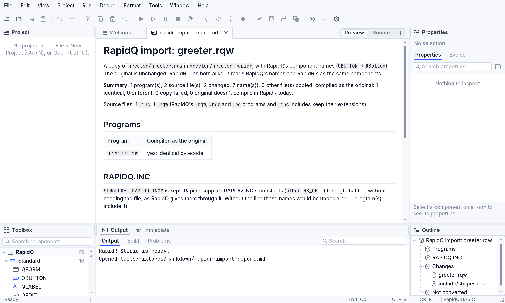
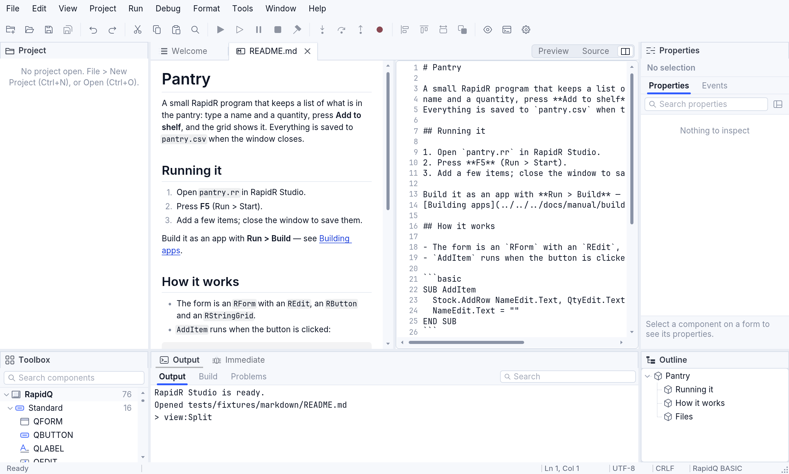

# Markdown files and RMarkdownView

Markdown is the plain-text format of `README.md` files, notes and reports:
`# Heading`, `**bold**`, `- list item`, `` `code` ``, `[link](url)`.
RapidR shows it **formatted**, as a reader sees it — in RapidR Studio, and
in your own programs with the `RMarkdownView` component.

## In RapidR Studio



**Opening a Markdown file.** A file ending in `.md` (or `.markdown`) opens
in **Preview**: headings, lists, tables and code as they are meant to be
read. Open one from the Project pane (double click), with **File > Open
Project or File…** (Ctrl+O; a `.md` file opens on its own, with or without
a project), or by clicking a link to it in another Markdown file. The report
RapidR writes when it imports a RapidQ program (`rapidr-import-report.md`)
opens the same way.



**Preview | Source.** At the right of the document tabs, a Markdown file
has a switch, as a form's file has *Design | Code*:

| Segment | Shortcut | Shows |
|---|---|---|
| **Preview** | Shift+F7 (View > Designer) | the text formatted |
| **Source** | F7 (View > Code) | the Markdown text, to edit |
| **Side by side** (the last button) | View > Designer and Code Side by Side | both: what you type in the source shows in the preview at once |

F12 (View > Toggle Form / Code) switches between Preview and Source.
Changes are saved with **File > Save** (Ctrl+S), as for code; the tab shows
a dot while a change isn't saved.



**Reading.** Scroll with the mouse wheel, the scroll bar or the keys (Up /
Down, Page Up / Page Down, Space, Home / End). Drag across text to select
it, then Ctrl+C (Cmd+C on a Mac) or **Edit > Copy** copies it; Ctrl+A or
**Edit > Select All** selects everything. A table's cells are copied
separated by tabs, so they paste into a spreadsheet as columns.

**Links.** Click a link:

- a web address (`https://…`, `mailto:…`) opens in your browser;
- another file (`notes.md`, `../docs/setup.md`) opens in Studio — a
  Markdown one in Preview, at the heading the link names (`notes.md#install`);
- a heading of the same file (`#running-it`) scrolls there.

**Outline.** The Outline pane lists the file's headings, nested by level.
Click one: the preview scrolls to it (in Source, the editor goes to its
line).

The source isn't coloured as BASIC: a `'` in a sentence is just an
apostrophe.

## In your programs: RMarkdownView

`RMarkdownView` shows a Markdown text formatted, the same on the desktop
and on the web, in the program's theme (light, dark, high contrast). Screen
readers hear its headings (with their level), lists, tables and links.

```basic
$INCLUDE "RAPIDQ.INC"   ' alClient, alBottom

SUB LinkClicked (Url AS STRING)
  Status.Caption = "You clicked " + Url
END SUB

CREATE Form AS RForm
  Caption = "Read me"
  Width = 640: Height = 480
  CREATE Doc AS RMarkdownView
    Align = alClient
    OnLinkClick = LinkClicked
  END CREATE
  CREATE Status AS RLabel
    Align = alBottom
  END CREATE
END CREATE

IF Doc.LoadFromFile("README.md") = 0 THEN
  Doc.Text = "# No README" + CHR$(10) + CHR$(10) + "*README.md* wasn't found."
END IF
Form.ShowModal
```

| Member | What it does |
|---|---|
| `Text` | the Markdown text shown (set it to show another) |
| `LoadFromFile(File)` | shows a file; True when it was read |
| `OnLinkClick(Url)` | a link was clicked; `Url` is its target as written |
| `OpenLinks` | True (the default): a web link opens in the browser by itself |
| `ScrollTo(Heading)` | scrolls a heading to the top, by its text or its anchor (`"#running-it"`) |
| `Headings` | the headings, a line each: level, text, anchor, line, separated by tabs |
| `PlainText`, `SelText` | the text as shown (without the marks), and the selected part |
| `SelectAll`, `Clear`, `LinkCount`, `EmptyText` | as their names say |

The full list is in the [reference](reference/members.md#rmarkdownview).

**What is shown.** CommonMark Markdown, with GitHub's tables and
`~~strikethrough~~`: headings, paragraphs, **bold**, *italic*, inline code,
links, bulleted and numbered lists (nested), block quotes, code blocks (a
` ```basic ` block is coloured as the code editor colours BASIC), tables
(columns aligned as the `:---:` row says) and rules. HTML inside the text
is left out, and a picture shows its description in italics instead of the
picture.

`RMarkdownView` is RapidR's own; RapidQ has no such component.
