<!-- Generated by `rapidr lang export --manual` from the language registry (crates/rapidr-lang/data). Do not edit: change the registry and run it again. -->

# Components: RapidQ's and RapidR's names

Every component RapidR creates, by what it is for. A RapidQ name and its R name are the same component (same properties, methods, events and behaviour); a program may use either and mix them freely. A name with no RapidQ name is RapidR's own. Unless the last column says otherwise, a component works in native builds, interpreted programs and the browser. Each component's members: [members.md](members.md). The icons are RapidR's own (the IDE's toolbox shows the same ones); every icon is in the [icon catalog](../icons/index.html).

## Forms and containers

| | RapidR name | RapidQ name | From | Where |
|---|---|---|---|---|
|  | [`RFORM`](members.md#rform) | `QFORM` | RapidQ | everywhere |
|  | [`RFORMMDI`](members.md#rformmdi) | `QFORMMDI` | RAPIDQ2.INC | everywhere |
|  | [`RPANEL`](members.md#rpanel) | `QPANEL` | RapidQ | everywhere |
|  | [`RTABCONTROL`](members.md#rtabcontrol) | `QTABCONTROL` | RapidQ | everywhere |
|  | [`RTOOLBAR`](members.md#rtoolbar) | — | RapidR | everywhere |
|  | [`RSTATUSBAR`](members.md#rstatusbar) | `QSTATUSBAR` | RapidQ | everywhere |
|  | [`RSPLITTER`](members.md#rsplitter) | `QSPLITTER` | RapidQ | everywhere |
|  | [`RSCROLLBOX`](members.md#rscrollbox) | `QSCROLLBOX` | RapidQ | everywhere |
|  | [`RGROUPBOX`](members.md#rgroupbox) | `QGROUPBOX` | RapidQ | everywhere |
|  | [`RBEVEL`](members.md#rbevel) | `QBEVEL` | QBevel.inc | everywhere |
|  | [`RGLASSFRAME`](members.md#rglassframe) | `QGLASSFRAME` | RapidQ | everywhere |
|  | [`RDOCKMANAGER`](members.md#rdockmanager) | — | RapidR | everywhere |

## Buttons and input

| | RapidR name | RapidQ name | From | Where |
|---|---|---|---|---|
|  | [`RBUTTON`](members.md#rbutton) | `QBUTTON` | RapidQ | everywhere |
|  | [`REDIT`](members.md#redit) | `QEDIT` | RapidQ | everywhere |
|  | [`RCHECKBOX`](members.md#rcheckbox) | `QCHECKBOX` | RapidQ | everywhere |
|  | [`RRADIOBUTTON`](members.md#rradiobutton) | `QRADIOBUTTON` | RapidQ | everywhere |
|  | [`RCOMBOBOX`](members.md#rcombobox) | `QCOMBOBOX` | RapidQ | everywhere |
|  | [`RRICHEDIT`](members.md#rrichedit) | `QRICHEDIT` | RapidQ | everywhere |
|  | [`RMEMO`](members.md#rmemo) | — | RapidR | everywhere |
|  | [`RSCROLLBAR`](members.md#rscrollbar) | `QSCROLLBAR` | RapidQ | everywhere |
|  | [`RUPDOWN`](members.md#rupdown) | — | RapidR | everywhere |
|  | [`RDATETIMEPICKER`](members.md#rdatetimepicker) | — | RapidR | everywhere |
| 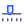 | [`RTRACKBAR`](members.md#rtrackbar) | `QTRACKBAR` | RapidQ | everywhere |
|  | [`RCODEEDITOR`](members.md#rcodeeditor) | — | RapidR | everywhere |
|  | [`RDIFFVIEW`](members.md#rdiffview) | — | RapidR | everywhere |
|  | [`RCOOLBTN`](members.md#rcoolbtn) | `QCOOLBTN` | RapidQ | everywhere |
|  | [`ROVALBTN`](members.md#rovalbtn) | `QOVALBTN` | RapidQ | everywhere |

## Display and drawing

| | RapidR name | RapidQ name | From | Where |
|---|---|---|---|---|
|  | [`RLABEL`](members.md#rlabel) | `QLABEL` | RapidQ | everywhere |
|  | [`RIMAGE`](members.md#rimage) | `QIMAGE` | RapidQ | everywhere |
|  | [`RCANVAS`](members.md#rcanvas) | `QCANVAS` | RapidQ | everywhere |
|  | [`RHEADER`](members.md#rheader) | `QHEADER` | RapidQ | everywhere |
|  | [`RPROGRESS`](members.md#rprogress) | — | RapidR | everywhere |
|  | [`RPROGRESSBAR`](members.md#rprogressbar) | `QGAUGE` | RapidQ | everywhere |
|  | [`RDESIGNSURFACE`](members.md#rdesignsurface) | — | RapidR | everywhere |
|  | [`RDIGDISPLAY`](members.md#rdigdisplay) | `QDIGDISPLAY` | QDigDisplay.inc | everywhere |

## Lists, grids and trees

| | RapidR name | RapidQ name | From | Where |
|---|---|---|---|---|
|  | [`RLISTBOX`](members.md#rlistbox) | `QLISTBOX` | RapidQ | everywhere |
|  | [`RFILELISTBOX`](members.md#rfilelistbox) | `QFILELISTBOX` | RapidQ | everywhere |
|  | [`RDIRTREE`](members.md#rdirtree) | `QDIRTREE` | RapidQ | everywhere |
|  | [`RSTRINGGRID`](members.md#rstringgrid) | `QSTRINGGRID` | RapidQ | everywhere |
| 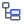 | [`RTREEVIEW`](members.md#rtreeview) | `QTREEVIEW`, `QOUTLINE` | RapidQ | everywhere |
| 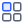 | [`RLISTVIEW`](members.md#rlistview) | `QLISTVIEW` | RapidQ | everywhere |

## Menus

| | RapidR name | RapidQ name | From | Where |
|---|---|---|---|---|
|  | [`RMAINMENU`](members.md#rmainmenu) | `QMAINMENU` | RapidQ | everywhere |
|  | [`RMENUITEM`](members.md#rmenuitem) | `QMENUITEM` | RapidQ | everywhere |
|  | [`RPOPUPMENU`](members.md#rpopupmenu) | `QPOPUPMENU` | RapidQ | everywhere |

## Dialogs

| | RapidR name | RapidQ name | From | Where |
|---|---|---|---|---|
|  | [`ROPENDIALOG`](members.md#ropendialog) | `QOPENDIALOG` | RapidQ | everywhere |
|  | [`RSAVEDIALOG`](members.md#rsavedialog) | `QSAVEDIALOG` | RapidQ | everywhere |
|  | [`RFILEDIALOG`](members.md#rfiledialog) | `QFILEDIALOG` | RAPIDQ2.INC | everywhere |
|  | [`RCOLORDIALOG`](members.md#rcolordialog) | `QCOLORDIALOG` | RAPIDQ2.INC | everywhere |
|  | [`RFONTDIALOG`](members.md#rfontdialog) | `QFONTDIALOG` | RapidQ | everywhere |

## Non-visual objects

| | RapidR name | RapidQ name | From | Where |
|---|---|---|---|---|
|  | [`RTIMER`](members.md#rtimer) | `QTIMER` | RapidQ | everywhere |
|  | [`RRECT`](members.md#rrect) | `QRECT` | RapidQ | everywhere |
|  | [`RFILESTREAM`](members.md#rfilestream) | `QFILESTREAM` | RapidQ | everywhere |
|  | [`RSTRINGLIST`](members.md#rstringlist) | `QSTRINGLIST` | RapidQ | everywhere |
|  | [`RPRINTER`](members.md#rprinter) | `QPRINTER` | RapidQ | everywhere |
| 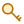 | [`RREGISTRY`](members.md#rregistry) | `QREGISTRY` | RapidQ | everywhere |
| 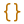 | [`RJSON`](members.md#rjson) | — | RapidR | everywhere |
|  | [`RFONT`](members.md#rfont) | `QFONT` | RapidQ | everywhere |
| 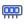 | [`RMEMORYSTREAM`](members.md#rmemorystream) | `QMEMORYSTREAM` | RapidQ | everywhere |
| 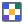 | [`RBITMAP`](members.md#rbitmap) | `QBITMAP` | RapidQ | everywhere |
|  | [`RIMAGELIST`](members.md#rimagelist) | `QIMAGELIST` | RapidQ | everywhere |
|  | [`RNOTIFYICONDATA`](members.md#rnotifyicondata) | `QNOTIFYICONDATA` | RapidQ | everywhere |

## Databases

| | RapidR name | RapidQ name | From | Where |
|---|---|---|---|---|
|  | [`RSQLITE`](members.md#rsqlite) | — | RapidR | everywhere |
|  | [`RMYSQL`](members.md#rmysql) | `QMYSQL` | RapidQ | desktop |

## Network, devices and CGI

| | RapidR name | RapidQ name | From | Where |
|---|---|---|---|---|
|  | [`RSOCKET`](members.md#rsocket) | `QSOCKET` | RapidQ | desktop (TCP); web (WebSocket) |
|  | [`RSERVERSOCKET`](members.md#rserversocket) | — | RapidR | desktop |
|  | [`RHTTP`](members.md#rhttp) | — | RapidR | everywhere |
|  | [`RCGI`](members.md#rcgi) | `QCGI` | qcgi.inc | everywhere |
|  | [`RCOMPORT`](members.md#rcomport) | `QCOMPORT`, `COMPORT` | RapidQ | desktop (serial2); web (Web Serial) |
|  | [`RDOWNLOAD`](members.md#rdownload) | `QDOWNLOAD` | Qdownload.inc | everywhere |

## Media

| | RapidR name | RapidQ name | From | Where |
|---|---|---|---|---|
| 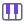 | [`RMIDI`](members.md#rmidi) | `QMIDI` | QMidi.inc | everywhere |
|  | [`RWAVE`](members.md#rwave) | `QWAVE` | QWave.inc | everywhere |
|  | [`RVIDEO`](members.md#rvideo) | `QVIDEO` | QVideo.inc | everywhere |
|  | [`RCDAUDIO`](members.md#rcdaudio) | `QCDAUDIO` | Qcdaudio.inc | everywhere |

## DirectX 2D

| | RapidR name | RapidQ name | From | Where |
|---|---|---|---|---|
|  | [`RDXSCREEN`](members.md#rdxscreen) | `QDXSCREEN` | RapidQ | everywhere |
|  | [`RDXIMAGELIST`](members.md#rdximagelist) | `QDXIMAGELIST` | RapidQ | everywhere |
|  | [`RDXTIMER`](members.md#rdxtimer) | `QDXTIMER` | RapidQ | everywhere |
|  | [`RDXSOUND`](members.md#rdxsound) | `QDXSOUND` | RapidQ | everywhere |
|  | [`RDXJOYSTICK`](members.md#rdxjoystick) | `QDXJOYSTICK` | RapidQ | everywhere |

## Direct3D (retained mode)

| | RapidR name | RapidQ name | From | Where |
|---|---|---|---|---|
| 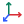 | [`RD3DFRAME`](members.md#rd3dframe) | `QD3DFRAME` | RapidQ | everywhere |
| 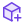 | [`RD3DMESHBUILDER`](members.md#rd3dmeshbuilder) | `QD3DMESHBUILDER` | RapidQ | everywhere |
|  | [`RD3DMESH`](members.md#rd3dmesh) | `QD3DMESH` | RapidQ | everywhere |
|  | [`RD3DFACE`](members.md#rd3dface) | `QD3DFACE` | RapidQ | everywhere |
|  | [`RD3DLIGHT`](members.md#rd3dlight) | `QD3DLIGHT` | RapidQ | everywhere |
| 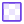 | [`RD3DTEXTURE`](members.md#rd3dtexture) | `QD3DTEXTURE` | RapidQ | everywhere |
|  | [`RD3DVISUAL`](members.md#rd3dvisual) | `QD3DVISUAL` | RapidQ | everywhere |
|  | [`RD3DWRAP`](members.md#rd3dwrap) | `QD3DWRAP` | RapidQ | everywhere |
|  | [`RD3DVECTOR`](members.md#rd3dvector) | `QD3DVECTOR` | RapidQ | everywhere |
| 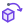 | [`RD3DANIMATION`](members.md#rd3danimation) | `QD3DANIMATION` | RapidQ | everywhere |
| 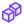 | [`RD3DANIMATIONSET`](members.md#rd3danimationset) | `QD3DANIMATIONSET` | RapidQ | everywhere |

## Data science

| | RapidR name | RapidQ name | From | Where |
|---|---|---|---|---|
| 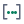 | [`RNUM`](members.md#rnum) | — | RapidR | everywhere |
|  | [`RDATAFRAME`](members.md#rdataframe) | — | RapidR | everywhere |
| 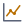 | [`RPLOT`](members.md#rplot) | — | RapidR | everywhere |

## Web only

| | RapidR name | RapidQ name | From | Where |
|---|---|---|---|---|
|  | [`RWEBVIEW`](members.md#rwebview) | — | RapidR | web |
|  | [`RDOM`](members.md#rdom) | — | RapidR | web |
|  | [`RJAVASCRIPT`](members.md#rjavascript) | — | RapidR | web |
|  | [`RWEBSTORAGE`](members.md#rwebstorage) | — | RapidR | web |
|  | [`RWEBAUDIO`](members.md#rwebaudio) | — | RapidR | web |
|  | [`RWEBVIDEO`](members.md#rwebvideo) | — | RapidR | web |
|  | [`RWEBNOTIFICATION`](members.md#rwebnotification) | — | RapidR | web |
|  | [`RWEBGEOLOCATION`](members.md#rwebgeolocation) | — | RapidR | web |
|  | [`RROUTER`](members.md#rrouter) | — | RapidR | web |

## IDE

| | RapidR name | RapidQ name | From | Where |
|---|---|---|---|---|
|  | [`RPROPERTYINSPECTOR`](members.md#rpropertyinspector) | — | RapidR | everywhere |
|  | [`RTOOLBOX`](members.md#rtoolbox) | — | RapidR | everywhere |
|  | [`RPROJECTTREE`](members.md#rprojecttree) | — | RapidR | everywhere |
|  | [`ROUTPUTCONSOLE`](members.md#routputconsole) | — | RapidR | everywhere |
|  | [`RCOMMANDPALETTE`](members.md#rcommandpalette) | — | RapidR | everywhere |
|  | [`RPROJECT`](members.md#rproject) | — | RapidR | everywhere |
|  | [`RLANGUAGESERVICE`](members.md#rlanguageservice) | — | RapidR | everywhere |
| 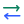 | [`RPROGRAMSESSION`](members.md#rprogramsession) | — | RapidR | everywhere |

## RapidQ's include libraries built in

A program that names these (or includes the library) gets RapidR's own implementation, written in BASIC on RapidR's components, on every runtime:

- `QDOCKFORM` (RapidQ's `QDockForm.inc`)
- `QDIRLISTVIEW` (RapidQ's `QDirListView.inc`)

## Not implemented

RapidQ has these objects (RC.EXE knows them); RapidR doesn't yet. Variables of the OLE types compile as generic objects whose methods print a warning:

- `QOLECONTAINER`: Hosts an embedded OLE object (a document or control of another program) on a form. Planned: RapidR doesn't have it yet.
- `QOLEOBJECT`: Drives a COM / OLE automation object (another program's) by calling its methods by name. Planned: RapidR doesn't have it yet.
- `QTHREAD`: Runs its OnExecute code in a background thread. Planned: RapidR doesn't have it yet.
- `QTRANSIMAGE`: A picture with a transparent colour that can shape and size its form to it. Planned: RapidR doesn't have it yet.

109 components; 76 of them have a RapidQ name.
