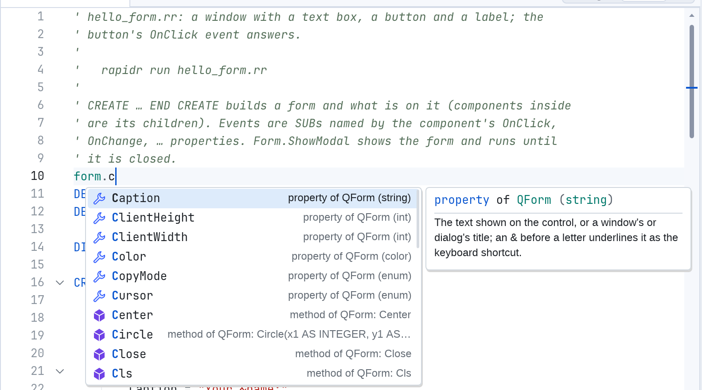
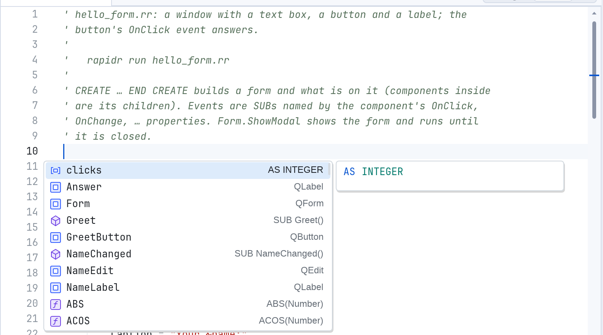
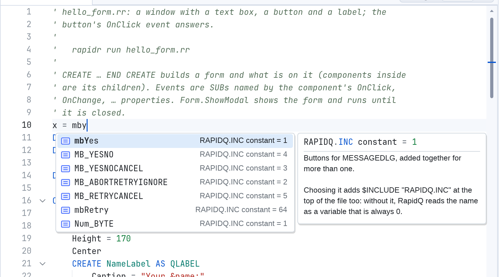
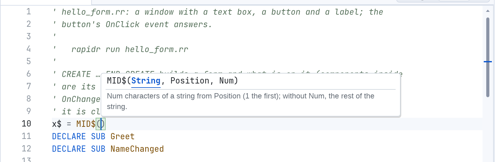
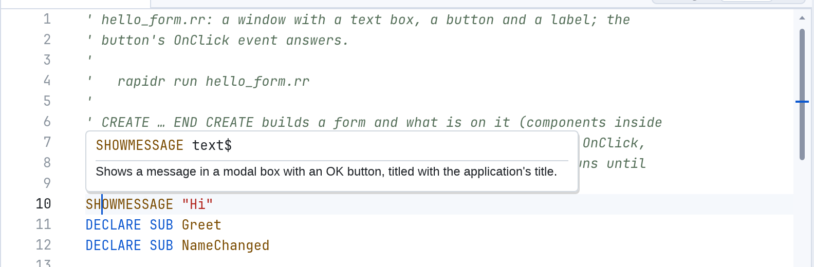
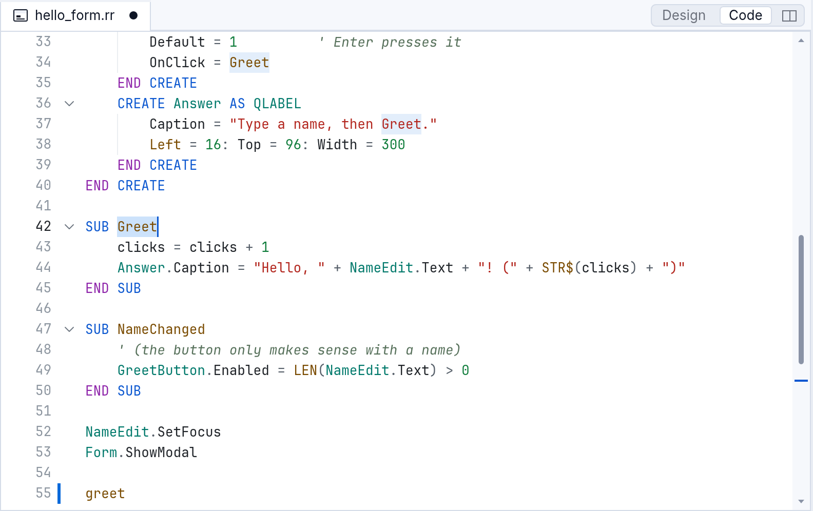
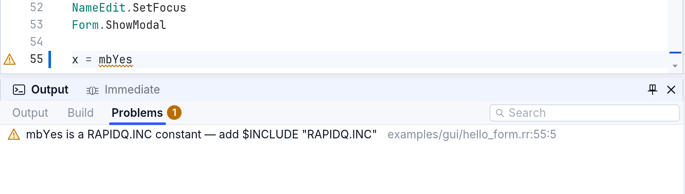
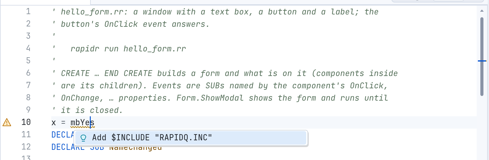

# The code editor in RapidR Studio

RapidR Studio's code editor knows your program as the compiler does. While
you type it suggests names, shows the parameters of the call you are
writing, explains any word you point at, jumps to where a name is defined,
and marks mistakes before you run. It works the same in the desktop Studio
and in Studio on the web.

The pictures below were made with `examples/gui/hello_form.rr` open (File >
Open Example…, then **Code** at the top right of its tab, or F7).

On a Mac, use **⌘ Cmd** where this page says **Ctrl** — except Ctrl+Space and
Ctrl+Shift+Space, which stay on the Control key (⌘ Space is Spotlight).

## Completion: names as you type

Start typing and a list of what fits appears under the caret. Type a dot
after a component and the list shows its properties, methods and events:



- The list narrows as you type. It matches the start of words too:
  `sm` finds `ShowModal`.
- The box on the right describes the selected entry: its type, what it does,
  and whether RapidQ has it.
- **Tab** or **Enter** puts the selected name in. **Escape** closes the list.
  **↑ ↓ Page Up Page Down** move through it. A click also chooses.
- Names you chose recently come first next time.

The list knows what each name is:

```basic
DIM Ok AS RBUTTON
Ok.          ' RButton's members: Caption, Left, OnClick …

DIM Buttons(3) AS RBUTTON
Buttons(1).  ' the same, for an element of an array

TYPE Point
    X AS INTEGER
    Y AS INTEGER
END TYPE
DIM p AS Point
p.           ' X and Y

WITH Ok
    .        ' RButton's members again
END WITH

CREATE Form AS RFORM
    Cap      ' inside a CREATE: what you can set — Caption = …
END CREATE
```

After `AS`, the list offers the built-in types, your TYPEs and every
component under RapidR's names (`RButton`, `RForm`). RapidQ's names
(`QButton`, `QForm`) work exactly the same: start typing one (`QBu`) and
the list offers it too, after RapidR's. In a file that already uses
RapidQ's names, the list offers those instead (and RapidR's once you type
an `R`), so a file keeps one style.

### Ctrl+Space

**Ctrl+Space** (Edit > Complete Word) opens the list at any place, also on an
empty line. There it shows your program's own names first — its variables,
components, SUBs and FUNCTIONs — then RapidR's functions, statements and
constants:



### RAPIDQ.INC's constants

Constants such as `mbYes`, `mtWarning`, `clRed` or `fmOpenRead` come from
the include file RAPIDQ.INC. The list offers them even before your program
includes it, and choosing one also adds the line `$INCLUDE "RAPIDQ.INC"`
at the top of the file (after its first comments). Ctrl+Z takes both back.



## Parameter info

Type `(` after a SUB, FUNCTION or method, and a box above the line shows
its parameters, the one you are typing in bold. It follows as you type
commas, and closes after the `)`.



To see it again, press **Ctrl+Shift+Space** (Edit > Advanced > Parameter
Info). It works for your own SUBs and FUNCTIONs as well:

```basic
SUB Greet(Name AS STRING, Times AS INTEGER)
    ...
END SUB

Greet("Ann",     ' the box shows Greet(Name AS STRING, Times AS INTEGER), Times in bold
```

## Hover: what a word is

Rest the mouse on a word for half a second and a box tells you what it is:
a statement's syntax and what it does, a component's property with its type,
or your own variable with its declaration and how often it is used. Edit >
Advanced > Show Hover does the same for the word at the caret.



F1 opens the full entry in the Help pane.

## F12: Go to Definition

Put the caret on a name and press **F12** (Edit > Go to Definition): the
caret jumps to where the name is defined — the SUB of a call, the `DIM` of a
variable, the `CREATE` of a component. If that is in another file (an
`$INCLUDE`), Studio opens it there. For a variable your program never
declares, F12 goes to the first place it is given a value.



F12 works in the code of a form's file too. To switch between a form's
designer and its code, use **F7** (code) and **Shift+F7** (designer), or the
**Design | Code** switch at the right of the tab.

Related: **Shift+F12** (Find References) selects every use of the name and
lists them in Output; **F2** renames a name everywhere it is used.

## Problems while you type

When you stop typing for a moment, Studio checks the program and underlines
what's wrong with a wavy line: red for errors, amber for warnings. A sign in
the margin marks the line, and the **Problems** tab under the editor (View >
Problems) lists them all, with their place. Click one to go there. The
messages are RapidQ's compiler's own words, so they read the same as when
you build.

### The RAPIDQ.INC warning

RapidQ — and RapidR, to run old programs the same way — reads a name it
doesn't know as a new variable that is 0. So if a program uses `mbYes`
without including RAPIDQ.INC, `mbYes` is 0, and a question like this one
shows only an OK button:

```basic
IF MessageDlg("Save changes?", mtWarning, mbYes OR mbNo, 0) = mrYes THEN
```

Studio warns about each such name:



### Quick fixes: Ctrl+.

Put the caret on an underlined word and press **Ctrl+.** (Edit > Quick
Fix…). A list of fixes appears; **Enter** applies the first. For the
warning above, the fix adds `$INCLUDE "RAPIDQ.INC"` to the top of the file:



Other fixes: a misspelt property (`NameEdit.Txet`) offers the nearest real
ones ("Change to Text"); in a RapidQ-compatible project, a Q name RapidQ
doesn't have (`QPLOT`) offers RapidR's (`RPLOT`).

## Typing help

- **Tab** at the start of a line indents it by the file's unit (four spaces,
  or a tab if the file uses tabs); **Shift+Tab** takes it back. On several
  selected lines they indent or outdent them all. Tab never puts a stray
  character in your code.
- Keywords are written in capitals as you finish each word (`dim` → `DIM`),
  and your own names as you declared them (`nameedit` → `NameEdit`).
- Brackets and quotes close themselves; typing the closing one steps over
  it.
- Snippets: type `sub`, `function`, `if`, `for`, `select`, `create`, `type`,
  `while`, `do` or `with` and press Tab for the whole block; Tab again moves
  to the next part to fill in.

## Keyboard shortcuts

| Keys | What it does | Menu |
|---|---|---|
| Ctrl+Space | Open completion here | Edit > Complete Word |
| Tab, Enter | Accept the selected suggestion | |
| Escape | Close the list or box | |
| Ctrl+Shift+Space | Parameter info | Edit > Advanced > Parameter Info |
| F12 | Go to Definition | Edit > Go to Definition |
| Shift+F12 | Find References | Edit > Find References |
| F2 | Rename everywhere | Edit > Rename Symbol… |
| Ctrl+. | Quick fix | Edit > Quick Fix… |
| F1 | Help on the word at the caret | Help |
| F7 / Shift+F7 | A form's code / designer | View > Code / Designer |
| Tab / Shift+Tab | Indent / outdent | Edit > Advanced > Indent / Outdent Lines |
| Ctrl+/ | Comment or uncomment the lines | Edit > Toggle Comment |
| Shift+Alt+F | Format the file | Edit > Format Document |
| Ctrl+F, Ctrl+H | Find, Replace | Edit > Find…, Replace… |
| F3 / Shift+F3 | Find next / previous | Edit > Find Next / Previous |
| Ctrl+Shift+F | Find in all the project's files | Edit > Find in Files… |
| Ctrl+G | Go to a line | Edit > Go to Line… |
| Ctrl+D | Select the next occurrence (several carets) | Edit > Advanced |
| Alt+Z | Word wrap on / off | Edit > Advanced > Word Wrap |
| Ctrl+Z / Ctrl+Y | Undo / redo | Edit > Undo / Redo |

## Settings

Studio keeps two editor settings in its registry key
(`HKCU\Software\RapidR\Studio`; on macOS and Linux RapidR's own registry
file):

- `KeywordCase`: `upper` (the default), `lower`, `proper` or `preserve`;
- `IdentifierCase`: `declaration` (your names as declared, the default) or
  `preserve`.

Your own programs can use the same editor: it is the RCodeEditor component
(see [Components](components.md) and the
[members reference](reference/members.md#rcodeeditor)).
