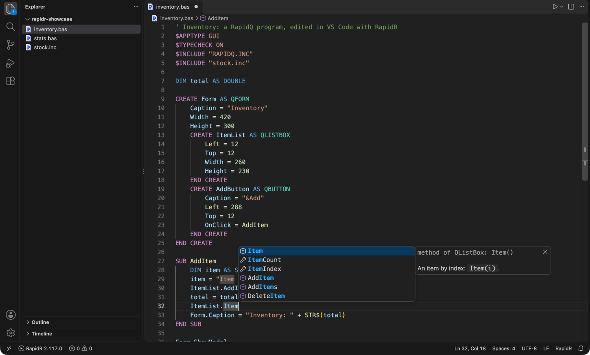
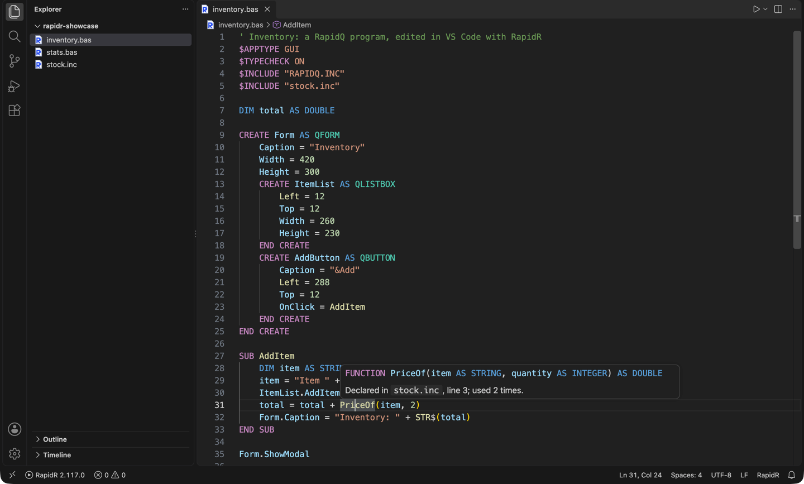
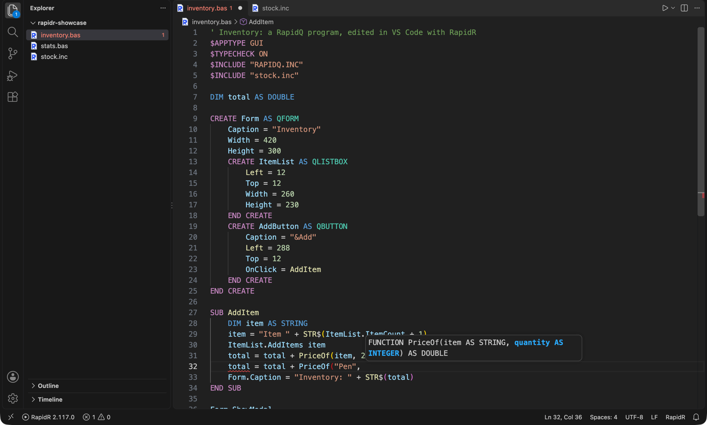
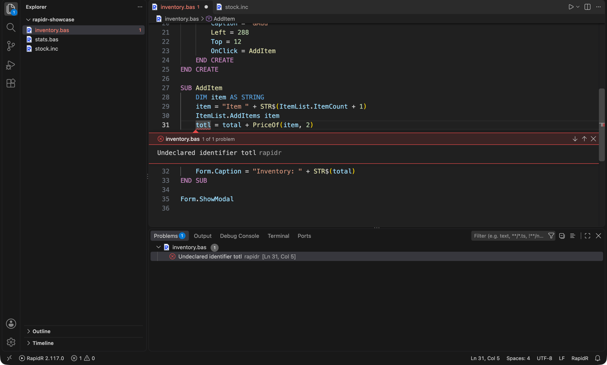
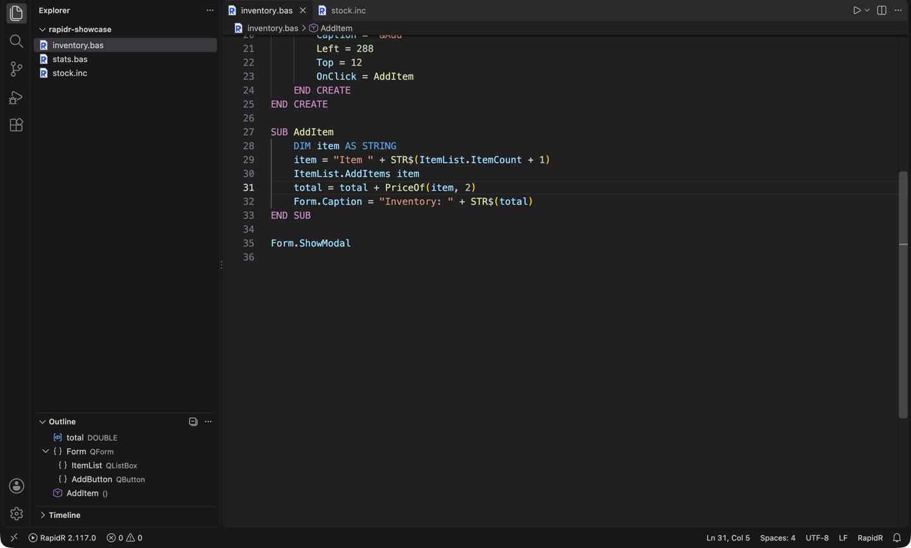
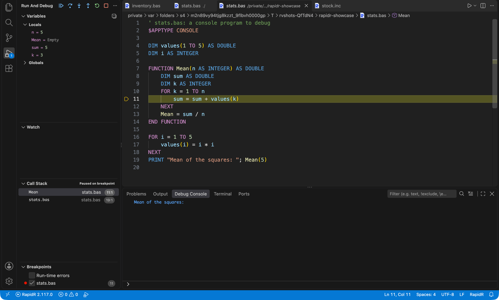

# RapidR for Visual Studio Code

Write, run and debug **RapidQ and RapidR BASIC** programs (`.bas`, `.rr`, `.inc`) in VS Code.

[RapidR](https://github.com/iBobX/RapidR) is compatible with RapidQ and written from the ground up in pure Rust. It has a compiler for native executables, an interpreter, and a web runtime. RapidQ programs run unchanged. RapidR adds data science, data components and modern GUI features.

This extension is a thin client. The language intelligence comes from RapidR itself: `rapidr lsp` is the language server and `rapidr dap` is the debugger. VS Code therefore gives the same answers as RapidR Studio, and both understand your program the way the compiler does.

> **You need RapidR installed.** Download it from the [releases page](https://github.com/iBobX/RapidR/releases). The extension looks for `rapidr` on your `PATH` and in the usual install places. If it can't find it, it asks you where it is.

## Features

### IntelliSense that knows your program

The completion list includes the builtins, the keywords, the components with their properties, methods and events, and your own variables, SUBs, FUNCTIONs and TYPEs. It also covers the files you `$INCLUDE`.

```basic
CREATE Form AS QFORM
    Caption = "Hello"
END CREATE

Form.          ' ← Caption, Width, ShowModal, OnClose, …
```



### Hover and signature help

Hover a builtin, a component member or one of your routines to see its signature and documentation. While you type a call, its parameters are shown.

```basic
s$ = MID$(text$, 2, 3)     ' MID$(str, start, [length])
```





### Diagnostics in RapidQ's words

Errors and warnings appear as you type, worded the way RapidQ's compiler words them:

```basic
$TYPECHECK ON
total = 1                  ' Undeclared identifier total
```



Turn on **RapidQ-compatible** (`rapidr.rapidqCompatible`) for programs that must still compile with RapidQ: RapidR's own components are flagged, and a Q-name RapidQ doesn't have (`QPLOT`) gets a quick fix (`RPlot`).

### Navigate and refactor

- **Go to Definition** (F12), including into `$INCLUDE` files.
- **Find All References** (Shift+F12).
- **Rename Symbol** (F2): a variable, SUB, FUNCTION, TYPE or component, everywhere it is used.
- **Outline** and breadcrumbs: SUBs, FUNCTIONs, TYPEs, the forms you CREATE and their components.
- **Format Document**.



### Run, build and debug

| Command | What it does |
|---|---|
| **RapidR: Run File** | Saves the file and runs it in the "RapidR" terminal: `rapidr run file.bas` |
| **RapidR: Debug File** (or F5) | Debugs it through `rapidr dap`: breakpoints, stepping, call stack, variables, watches |
| **RapidR: Build Native Executable** | `rapidr build file.bas --release` (needs Rust; `rapidr setup` installs it) |
| **RapidR: Build Standalone Executable (Interpreted)** | `rapidr build file.bas --interp`: one executable, no Rust needed |
| **RapidR: Bundle for the Web (.zip)** | `rapidr bundle-bc file.bas -o file-web.zip`: a folder any static web host serves |

Run and Debug are also on the editor's title bar. Every command is in the RapidR status bar item, which shows the version of RapidR in use.



F5 works without a `launch.json`: it debugs the file in the active editor. To give a program arguments or a working folder, add a configuration:

```json
{
  "type": "rapidr",
  "request": "launch",
  "name": "RapidR: my program",
  "program": "${workspaceFolder}/main.bas",
  "args": ["--verbose"],
  "cwd": "${workspaceFolder}",
  "stopOnEntry": false
}
```

### Syntax highlighting and snippets

The extension highlights RapidQ and RapidR syntax, including every component under both its `Q` and `R` name. It also has snippets for blocks (`if`, `for`, `select`, `sub`, `func`, `type`), forms and components (`createform`, `createbutton`, …), and program skeletons (`rpcons`, `rpgui`).

## Settings

| Setting | Default | |
|---|---|---|
| `rapidr.path` | (empty) | The `rapidr` executable, the folder it is in, or `RapidR.app`. When empty, the extension looks on `PATH`, then in the usual install places, then in a RapidR source checkout open in the workspace. |
| `rapidr.rapidqCompatible` | `false` | Warn about everything RapidQ doesn't have. |
| `rapidr.trace.server` | `off` | Log the language server's messages in the "RapidR Language Server" output. |

## Commands

The commands above, and also:

- **RapidR: Restart Language Server**
- **RapidR: Show Language Server Output**
- **RapidR: Locate rapidr…**

## Troubleshooting

- **"RapidR was not found."** Install RapidR, or choose **Locate rapidr…** and pick the executable. On macOS, you can pick `RapidR.app`. On Windows, the installer puts it in `%LOCALAPPDATA%\Programs\RapidR\bin\rapidr.exe`.
- **No completion or diagnostics.** Run **RapidR: Show Language Server Output**. A RapidR older than the language server has no `rapidr lsp`, so update RapidR.
- **Untrusted workspaces.** In an untrusted workspace, the extension ignores the workspace's `rapidr.path` and doesn't run a `rapidr` built inside it.

## Licence

MIT. The bundled JavaScript packages and their licences are listed in [THIRD_PARTY_NOTICES.md](THIRD_PARTY_NOTICES.md).
